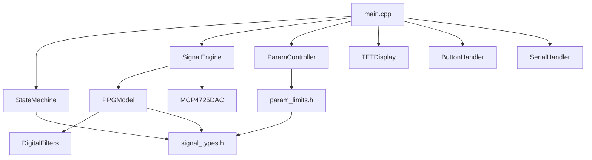
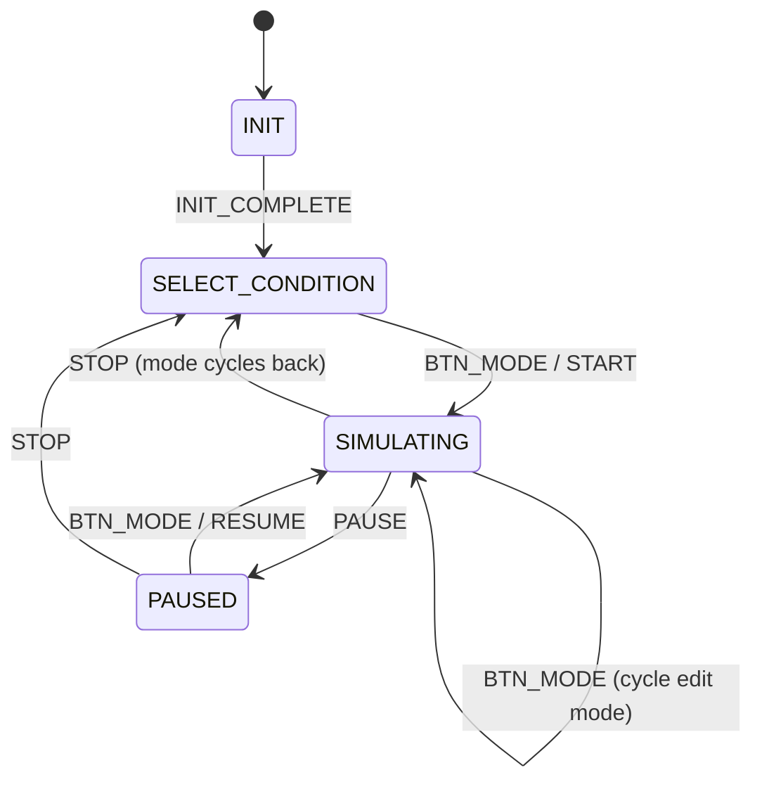

# CLAUDE.md — PPG Signal Simulator Architecture Guide

> **AI-generated documentation for the PPG Signal Simulator firmware.**
> This file provides complete context for understanding, modifying, and extending the codebase.

---

## 1. Project Overview

**PPG Signal Simulator** is an ESP32-S3 firmware that generates realistic photoplethysmography (PPG) signals. It synthesizes analog PPG waveforms with physiologically accurate morphology across 6 clinical conditions and outputs them via a 12-bit DAC for connection to external monitoring equipment.

### Key Specifications

| Feature | Value |
|---------|-------|
| MCU | ESP32-S3-DevKitC-1 (Dual-core, 240 MHz) |
| Display | 1.8" TFT ST7735 (160×128, SPI) |
| DAC Output | MCP4725 (12-bit, I2C, 0–3.3V) |
| Controls | 3 push buttons (Mode, Up, Down) |
| Signal | PPG only (6 clinical conditions) |
| Model Rate | 100 Hz (Nyquist: 20 Hz for 10 Hz BW) |
| DAC Rate | 1 kHz (10× oversampling) |
| Architecture | Dual-core FreeRTOS |

---

## 2. Hardware Interface

### Pin Assignments

```
ESP32-S3 Pin Map
═══════════════════════════════════════
TFT Display (SPI — ST7735 1.8"):
  GPIO11 → TFT_MOSI (data)
  GPIO12 → TFT_SCLK (clock)
  GPIO10 → TFT_CS   (chip select)
  GPIO4  → TFT_DC   (data/command)
  GPIO5  → TFT_RST  (reset)

MCP4725 DAC (I2C):
  GPIO8  → I2C_SDA
  GPIO9  → I2C_SCL
  Address: 0x60

Push Buttons (Active LOW, internal pull-up):
  GPIO14 → BTN_MODE  (cycle edit modes)
  GPIO15 → BTN_UP    (increment/next)
  GPIO16 → BTN_DOWN  (decrement/prev)

Status LED:
  GPIO2  → Onboard LED
```

### Hardware Schematic (Logical)

```
                   ┌─────────────────┐
                   │    ESP32-S3     │
                   │                 │
    TFT ST7735 ◄───┤ SPI (11,12,10) │
    (160×128)      │     DC=4,RST=5 │
                   │                 │
    MCP4725 DAC ◄──┤ I2C (SDA=8,    │──► Analog Out (BNC)
    (12-bit)       │      SCL=9)    │    0–3.3V PPG Signal
                   │                 │
    BTN_MODE ──────┤ GPIO14         │
    BTN_UP ────────┤ GPIO15         │
    BTN_DOWN ──────┤ GPIO16         │
                   │                 │
                   │ GPIO2 → LED     │
                   └─────────────────┘
```

---

## 3. Software Architecture

### Dual-Core Task Distribution

```
Core 0 (UI + Control)              Core 1 (Real-time Generation)
═══════════════════                ═══════════════════════════
loop() @ ~100 Hz                   generationTask() - continuous
├── handleButtons()                ├── PPGModel.generateSample() @ 100 Hz
├── updateDisplay()                ├── Linear Interpolation → 1 kHz
│   ├── TFT waveform @ 50 Hz      ├── Ring Buffer fill
│   └── Metrics text @ 4 Hz       └── MCP4725 DAC write @ 1 kHz
└── serialHandler.process()
```

### Module Dependency Graph



---

## 4. Source Code Structure

```
BioSignalSimulatorPro/
├── include/
│   ├── config.h                    # System config, pins, sampling rates
│   ├── data/
│   │   ├── signal_types.h          # PPG types, enums, state machine
│   │   └── param_limits.h          # Per-condition parameter ranges
│   ├── core/
│   │   ├── signal_engine.h         # Signal generation orchestrator
│   │   ├── state_machine.h         # System state machine
│   │   ├── param_controller.h      # Parameter validation & clamping
│   │   └── digital_filters.h       # Biquad IIR filter chains
│   ├── models/
│   │   └── ppg_model.h             # PPG waveform synthesis model
│   ├── hw/
│   │   ├── tft_display.h           # TFT ST7735 display driver
│   │   ├── mcp4725_dac.h           # MCP4725 DAC wrapper
│   │   └── button_handler.h        # ISR-based button handler
│   └── comm/
│       └── serial_handler.h        # Serial debug interface
├── src/
│   ├── main.cpp                    # Application entry point
│   ├── core/
│   │   ├── signal_engine.cpp
│   │   ├── state_machine.cpp
│   │   ├── param_controller.cpp
│   │   └── digital_filters.cpp
│   ├── models/
│   │   └── ppg_model.cpp           # PPG physiological model (732 lines)
│   ├── hw/
│   │   ├── tft_display.cpp
│   │   ├── mcp4725_dac.cpp
│   │   └── button_handler.cpp
│   └── comm/
│       └── serial_handler.cpp
└── platformio.ini                  # Build configuration
```

---

## 5. Signal Generation Pipeline

### PPG Model (ppg_model.cpp)

The PPG model generates physiologically accurate waveforms using a **3-component Gaussian decomposition**:

1. **Systolic peak** — Primary blood volume pulse (position: 15% of RR cycle)
2. **Dicrotic notch** — Aortic valve closure artifact (position: 30%)
3. **Diastolic peak** — Reflected arterial wave (position: 40%)

```
PPG Waveform Components:

    Systolic Peak
        ∧
       / \        Diastolic Peak
      /   \         ∧
     /     \       / \
    /       \_____/   \___________
              ^
          Dicrotic
           Notch

    |←systole→|←──diastole──────→|
    |←────── RR interval ───────→|
```

### Key Physiological Rules

- **Systole duration is ~constant** (~300ms), diastole absorbs HR changes
- **PI (Perfusion Index)** controls AC amplitude: `AC = PI × 15 mV`
- Each condition modifies waveform shape parameters (notch depth, diastolic ratio, etc.)
- **HR and PI have beat-to-beat variability** via Gaussian random (CV% configurable)

### Sampling Pipeline

```
PPGModel (100 Hz) → Linear Interpolation (10×) → Ring Buffer (1 kHz) → MCP4725 DAC
    ↑                                                                      ↓
generateSample()                                                    3.3V analog out
returns AC value                                                    (0–4095, 12-bit)
```

---

## 6. Clinical Conditions

| # | Condition | HR Range | PI Range | Notch | Description |
|---|-----------|----------|----------|-------|-------------|
| 0 | Normal | 60–100 | 2.9–6.1% | 0.15–0.35 | Healthy PPG waveform |
| 1 | Arrhythmia | 60–180 | 1.0–5.0% | 0.10–0.30 | Irregular RR intervals (high CV) |
| 2 | Weak Perfusion | 70–120 | 0.5–2.1% | 0.0–0.10 | Low AC amplitude, poor perfusion |
| 3 | Vasoconstriction | 65–110 | 0.5–0.8% | 0.0–0.10 | Very low PI, flat waveform |
| 4 | Strong Perfusion | 60–90 | 7.0–20% | 0.25–0.45 | High AC amplitude, prominent notch |
| 5 | Vasodilation | 60–90 | 5.0–10% | 0.20–0.40 | Moderate-high PI, strong diastole |

---

## 7. User Interface

### TFT Display Layout (160×128 landscape)

```
┌──────────────────────────────────────────┐
│ HR:75 BPM  PI:3.0%         Normal       │ ← Header (20px)
├──────────────────────────────────────────┤
│                                          │
│  ·  ·  ·  ·  ·  ·  ·  ·  ·  ·  ·  ·  │ Grid lines
│          ∧         ∧                     │
│         / \       / \                    │ Waveform
│        /   \_____/   \_____              │ (98px)
│  ·  ·  ·  ·  ·  ·  ·  ·  ·  ·  ·  ·  │
│                                          │
├──────────────────────────────────────────┤
│ < 1: Normal >                            │ ← Footer (10px)
└──────────────────────────────────────────┘
```

### Button Control Flow

```
┌──────────────────────────────────────────────────────────┐
│                    MODE BUTTON                           │
│  ┌──────────┐    ┌──────────┐    ┌─────────┐    ┌─────┐│
│  │ Condition│───►│  Edit HR │───►│ Edit PI │───►│Noise││
│  │  Select  │    │  (BPM)   │    │   (%)   │    │ (%) ││
│  └────┬─────┘    └──────────┘    └─────────┘    └──┬──┘│
│       │                                             │    │
│       └─────────────────────────────────────────────┘    │
│                      (cycles)                            │
├──────────────────────────────────────────────────────────┤
│ UP/DOWN buttons: adjust the selected parameter           │
│ In Condition mode: cycles through 6 conditions           │
│ In Edit mode: increments/decrements by step              │
│   HR: ±5 BPM, PI: ±0.5%, Noise: ±1%                    │
└──────────────────────────────────────────────────────────┘
```

### State Machine



---

## 8. Key Data Structures

### PPGParameters
```cpp
struct PPGParameters {
    PPGCondition condition;     // 0-5 (Normal, Arrhythmia, ...)
    float heartRate;            // BPM (40–180)
    float perfusionIndex;       // PI % (0.5–20)
    float noiseLevel;           // 0.0–0.10 (0–10%)
    float dicroticNotch;        // Notch depth (0.0–1.0)
    float amplification;        // Waveform gain (0.5–2.0)
};
```

### UIEditMode
```cpp
enum class UIEditMode {
    CONDITION_SELECT,   // Up/Down selects PPG condition
    EDIT_HR,            // Up/Down adjusts heart rate
    EDIT_PI,            // Up/Down adjusts perfusion index
    EDIT_NOISE          // Up/Down adjusts noise level
};
```

---

## 9. Build & Flash

### Prerequisites
- PlatformIO CLI or IDE
- ESP32-S3 connected via USB (port: `/dev/ttyACM0`)

### Build
```bash
pio run -e esp32_s3
```

### Flash
```bash
pio run -e esp32_s3 --target upload
```

### Monitor Serial
```bash
pio device monitor
```

### Serial Commands
| Key | Action |
|-----|--------|
| `h` | Show help |
| `i` | System info (heap, CPU, DAC, display) |

---

## 10. Dependencies

| Library | Version | Purpose |
|---------|---------|---------|
| `bodmer/TFT_eSPI` | ^2.5.43 | TFT display driver (ST7735) |
| `adafruit/Adafruit MCP4725` | ^2.0.2 | I2C DAC driver |
| Arduino Framework | - | Core HAL for ESP32-S3 |

---

## 11. Design Decisions

1. **MCP4725 DAC writes in task, not ISR** — I2C is not ISR-safe. The generation task on Core 1 handles both sample generation and DAC output at ~1 kHz via polling with `micros()`.

2. **12-bit DAC resolution** — MCP4725 provides 4096 levels (0.806 mV/step) vs. the ESP32 internal DAC's 256 levels (12.9 mV/step). This gives 16× finer voltage resolution.

3. **Sweep-line waveform rendering** — The TFT display uses a sweep approach (like an oscilloscope) rather than scrolling. New data overwrites old data left-to-right, with an erase cursor 2 pixels ahead.

4. **Button debouncing in ISR** — Uses `millis()` comparison within the ISR for 200ms debounce. This avoids the need for a separate debounce task while keeping the main loop clean.

5. **PPG AC-only output** — The DAC outputs only the pulsatile (AC) component of the PPG signal (0–150 mV → 0–3.3V). The DC baseline is not included because it carries no diagnostic information.

---

## 12. Extending the System

### Adding a new PPG condition
1. Add entry to `PPGCondition` enum in `signal_types.h`
2. Add limits in `getPPGLimits()` in `param_limits.h`
3. Add condition ranges in `initConditionRanges()` in `ppg_model.cpp`
4. Add condition name string in `getConditionName()` in `ppg_model.cpp`
5. Add name to `conditionNames[]` array in `main.cpp`
6. Update `PPGCondition::COUNT`

### Adding a new adjustable parameter
1. Add field to `PPGParameters` struct
2. Add `UIEditMode::EDIT_NEW_PARAM` enum value
3. Add step constant (`NEW_PARAM_STEP`) in `param_limits.h`
4. Handle in `handleButtons()` Up/Down cases in `main.cpp`
5. Add display rendering in `updateDisplay()` in `main.cpp`
