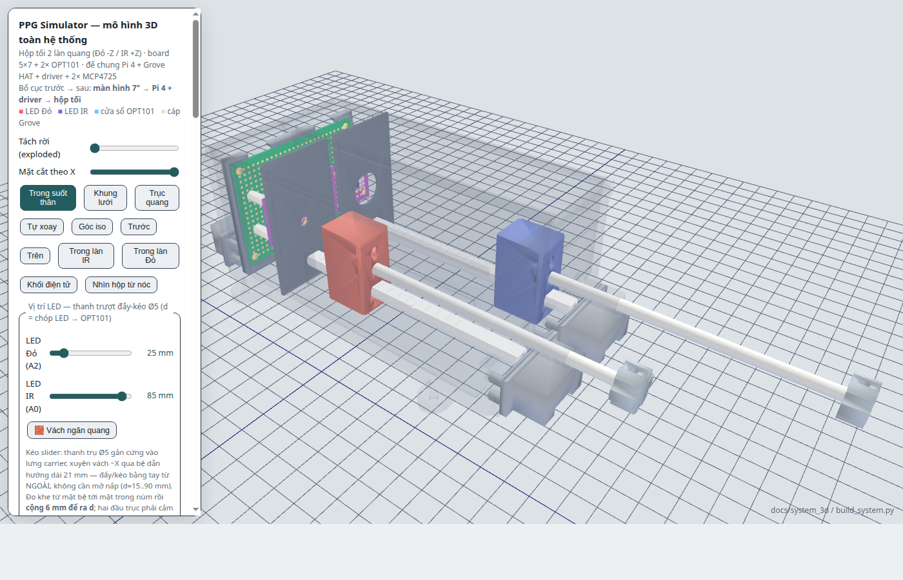

# Đối chiếu cơ khí v4 — 2026-09-06

Đã sửa nguồn tham số, tái sinh STL, mô hình web và ảnh. Kết quả kiểm tra hình học:
**243/243 PASS**. Dữ liệu từng phép kiểm tra: [out/fit_report.json](out/fit_report.json).

## Ba vấn đề được yêu cầu

| Vấn đề | Sửa trong v4 | Kích thước kết quả |
|---|---|---|
| Tai lồi trên bốn khẩu độ | Bỏ hoàn toàn tai và phần tăng bề dày; giữ tấm phẳng chữ nhật | 62.9 × 34.9 × 1.6 mm; bịt/Ø2/Ø5/Ø16 |
| Vấu nhô dưới nắp | Bỏ hai vấu giữ board; chuyển vai giữ sang thân; khoét rãnh âm nhận khẩu độ | Rãnh rộng 2.2, sâu 1.1; ăn mép 0.8; khe trên 0.3; mái đặc 1.9 mm |
| Thiếu trục tròn đẩy carrier | Chuyển từ chi tiết chỉ hiển thị thành nguồn hình học xuất STL và xếp đủ hai bản | `12_truc_day_tron_D5x130.stl`, Ø5 × 130, vát đầu 0.4 mm |

Kiểm tra mô hình v3 tại vị trí danh nghĩa cho thấy **nắp và khẩu độ chưa có thể tích
chồng lấn**: vấu nắp nằm ở khung board phía sau (X≈135–137), còn khẩu độ ở X≈114.
Việc sửa nhằm loại bỏ tai/vấu thừa, tạo chỗ nhận tấm có khe hở rõ ràng, và giúp in/lắp.
Không suy diễn ảnh chụp thành bằng chứng đã va chạm trên CAD.

## Lỗi khác tìm được khi rà cả cụm

- Gói cũ chỉ xếp một bản mỗi mẫu, thiếu số lượng hai làn, không có trục tròn và
  khung board. V4 gồm **13 mẫu, 23 chi tiết, hai bàn in**. Tám khẩu độ là bốn cặp
  thay thế; tại mỗi thời điểm chỉ lắp hai tấm.
- Phép xoay ray D cũ chưa đưa mặt phẳng xuống mặt bàn. Nay kích thước tư thế in
  là **110 × 8 × 6.5 mm**, mặt phẳng áp bàn.
- Gối phải của ray D mở lên trên để đưa ray vào từ nóc rồi dịch trái 3 mm vào
  lỗ mù; không chỉ kiểm tra vị trí cuối mà bỏ qua đường lắp.
- Cửa dây v3 có dao cắt dừng cách mặt vách 0.5 mm. Bên +X tạo khoang kín bên
  trong nhựa. Nay bốn cửa cáp xuyên hết vách; mộng và chụp che sáng vẫn giữ.
- Lỗ giữ trục ở carrier và núm từ Ø5.1 lên Ø5.4; có vít chặn để truyền lực kéo.
  Bổ sung đúng **2 vít M3×8 ở carrier** và **2 vít M3×6 ở núm** vào danh mục.
- Nắp úp mặt ngoài phẳng xuống bàn. Khẩu độ chỉ xoay khi xuất, không còn cắt
  bớt tai bằng một hình học khác với viewer.
- Viewer và ảnh chỉ hiện một khẩu độ mỗi làn, thay vì chồng cả bốn lên nhau.
  Các đường dẫn tải STL hoạt động theo cùng cấu trúc `out/` ở local và script deploy.

## Phạm vi đo/kiểm tra

| Kiểm tra | Kết quả |
|---|---|
| Bộ STL hệ lắp ráp | 16 mẫu; watertight; mỗi mẫu một khối đặc liên thông |
| Cặp lắp của bộ đầy đủ | 339 cặp, gồm hai làn, mọi loại khẩu độ, khung, nắp, đế và hai chân màn hình |
| STL Bambu đưa về hệ lắp ráp | 241 cặp, không lấy mesh dựng mới để thay thế file xuất khi kiểm tra va chạm |
| Sai khác hình học giữa nguồn simple và STL sau xoay | Trong ngưỡng số học 0.05 mm³ của phép hiệu đối xứng |
| Trượt carrier/trục/núm | d=15..90 mm, bước 0.5 mm; 151 vị trí mỗi làn, cả full và Bambu |
| Đưa khẩu độ và khung vào thân | Quét từ trên xuống, bước 1 mm |
| Lắp ray D | Hạ ở vị trí lệch +X 3 mm, sau đó dịch trái vào lỗ mù |
| Đóng nắp khi có khẩu độ và khung | 33 vị trí, bước 0.25 mm trong 8 mm cuối |
| Lỗ/mộng/rãnh | Ray-cast điểm và boolean khối nhỏ đối chiếu độc lập |
| Hai bàn Bambu | 14 + 9 khối rời, đúng số lượng; trong bàn 256×256; mép ≥8 mm; không chồng footprint |
| Khả năng tái sinh | Cùng nguồn Python; manifest kèm SHA-256 và kích thước từng STL |

Ngưỡng giao nhau dùng để báo lỗi: **10⁻⁴ mm³**. Thể tích giao lớn nhất ở phép
kiểm tra tĩnh full khoảng 6×10⁻¹³ mm³ (sai số tính toán); ở các bước quét hành trình
và STL Bambu bằng 0 trong kết quả hiện tại.

Đã kiểm tra thêm trong Chrome headless: WebGL chạy, mỗi làn chỉ hiện một khẩu độ,
đổi khẩu độ tự ẩn tấm cũ, trục/carrier/núm đi cùng nhau ở hai đầu hành trình.
Cả 20 liên kết tải STL/manifest đều trỏ tới file có thật.

## Dung sai lắp danh nghĩa

| Khớp | Khe hở hoặc độ ăn khớp (mm) |
|---|---|
| Tấm 1.6 trong rãnh thân 2.0 | 0.20 mỗi mặt |
| Tấm 1.6 trong rãnh nắp 2.2 | 0.30 mỗi mặt |
| Đỉnh tấm / đáy rãnh nắp | 0.30 |
| Tấm đi lên vào nắp | 0.80 |
| Tấm đi xuống rãnh sàn | 1.10 |
| Mép tấm / vách làn | 0.30 mỗi bên; gân chồng mép 1.30 |
| Trục Ø5 / lỗ Ø5.4 | 0.20 theo bán kính |
| Trục / carrier; trục / núm | Chiều sâu lắp 15; 6 |
| Ray D Ø8 / lỗ D carrier Ø8.5 | 0.25 theo bán kính, mặt phẳng chừa 0.25 |
| Khung board / vai trước thân | 0.30 theo X |
| Trụ chụp Ø4 / lỗ Ø4.3 | 0.15 theo bán kính |
| Gân chụp / rãnh mộng | 0.15 mỗi mặt; đáy 0.20 |

Chưa đo trên mẫu in: co ngót, nhám bề mặt, độ thẳng trục nhựa, lực đẩy/kéo,
lực giữ trụ chụp và độ rò sáng. Quét hành trình là kiểm tra mẫu rời rạc trong CAD,
không phải chứng minh liên tục hay thử nghiệm vật lý. Kích thước điện tử gắn
`[ASSUME]` vẫn phải đối chiếu linh kiện thực. Dây mềm, đầu vít mua ngoài và lớp
support/brim không nằm trong bộ khối in được dùng để kiểm tra va chạm.

Đọc [hướng dẫn in/lắp](README.md) trước khi dùng bộ mới; giữ tỷ lệ 100% để các
lỗ/trục giữ đúng đường kính. ZIP cũ `print_bambu.zip` không được ghi đè; bộ mới
có tên `print_bambu_v4.zip` để tránh nhầm hai phiên bản.
