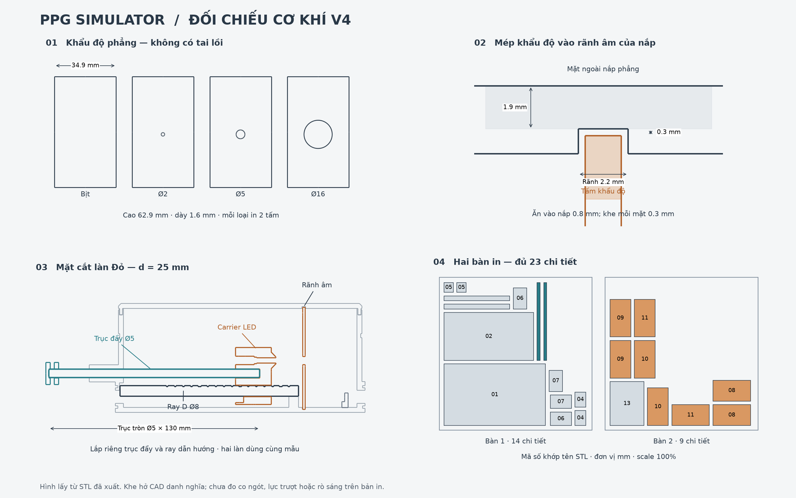

# PPG Simulator — mô hình cơ khí v4

Nguồn tham số: [build_system.py](build_system.py). Bản v4 sửa khẩu độ, nắp,
bổ sung trục đẩy tròn vào STL và kiểm tra lại đường lắp ráp hai làn quang.
Báo cáo: [MECHANICAL_V4_REVIEW.md](MECHANICAL_V4_REVIEW.md).



## File dùng để in

**Dùng bộ v4 trong [out/print_bambu/](out/print_bambu/), đơn vị mm, tỷ lệ 100%.**
Tải trọn bộ: [print_bambu_v4.zip](out/print_bambu_v4.zip).
In mỗi bàn dưới đây **một lần**; số lượng hai làn đã được xếp đủ:

| Bàn | Nội dung | Kích thước bao STL, X × Y × Z (mm) |
|---|---|---|
| [00_ban_1_co_khi.stl](out/print_bambu/00_ban_1_co_khi.stl) | 14 chi tiết cơ khí: thân, nắp, 2 ray D, 2 carrier, 2 núm, 2 trục tròn, 4 chụp | 213.5 × 239 × 64 |
| [00_ban_2_khau_do_khung.stl](out/print_bambu/00_ban_2_khau_do_khung.stl) | 8 khẩu độ + 1 khung board | 235.5 × 211.2 × 4 |

Tổng **23 chi tiết**. Khi lắp chỉ dùng **một khẩu độ mỗi làn**, sáu tấm còn lại
là phương án thay thế. Bản cũ `00_ppg_hop_toi_A1_all_in_one.stl` chỉ có một bản
của mỗi chi tiết, thiếu trục đẩy và khung board; đã được thay bằng hai bàn trên.
File ZIP cũ đã tải trước v4 cần được thay bằng bộ mới.

Nếu in từng STL riêng, dùng số lượng sau (không in thêm hai bàn gộp):

| File trong `out/print_bambu/` | Số lượng | Kích thước in X × Y × Z (mm) |
|---|---:|---|
| `01_than_hop_toi.stl` | 1 | 170 × 103 × 64 |
| `02_nap_labyrinth.stl` | 1 | 150 × 80 × 6.8 |
| `03_truc_truot_D.stl` | 2 | 110 × 8 × 6.5 |
| `04_carrier_led.stl` | 2 | 25 × 18 × 35 |
| `05_num_thanh_truot.stl` | 2 | 16 × 15.52 × 8 |
| `06_chup_luon_day_trai.stl` | 2 | 22.5 × 35.5 × 16.5 |
| `07_chup_luon_day_phai.stl` | 2 | 22.5 × 35.5 × 16.5 |
| `08_khau_do_biet.stl` | 2 | 62.9 × 34.9 × 1.6 |
| `09_khau_do_lo2mm.stl` | 2 | 62.9 × 34.9 × 1.6 |
| `10_khau_do_lo5mm.stl` | 2 | 62.9 × 34.9 × 1.6 |
| `11_khau_do_lo16mm.stl` | 2 | 62.9 × 34.9 × 1.6 |
| [12_truc_day_tron_D5x130.stl](out/print_bambu/12_truc_day_tron_D5x130.stl) | 2 | 130 × 5 × 5 |
| `13_khung_board_5x7.stl` | 1 | 56.8 × 73.4 × 4 |

[manifest.json](out/print_bambu/manifest.json) ghi kích thước, số lượng,
vị trí trên bàn và SHA-256 của từng STL. Hai bàn chừa tối thiểu 8 mm mép bàn,
khe giữa các footprint tối thiểu 6 mm; chưa bao gồm brim/support do slicer sinh.

`out/stl/` chứa **16 mẫu STL theo hệ lắp ráp Y hướng lên**. Chúng dùng cho
kiểm tra hình học, cần chọn lại tư thế nếu mở trực tiếp trong slicer. Các mẫu
`*_red` dùng chung cho Đỏ và IR, in hai bản. Ngoài bộ hộp tối, thư mục này có
`base_neg.stl` ×1, `base_pos.stl` ×1, `screen_foot_1.stl` ×2 để in đế hệ thống.
Hai bàn Bambu ở trên không chứa đế và chân màn hình.

## Các khớp lắp đã sửa

- **Khẩu độ:** tấm chữ nhật phẳng dày 1.6 mm, không còn tai cầm hoặc phần lồi
  trên hai mặt. Mép trên ở Y=64.8 mm; mở nắp rồi cầm mép tấm bằng nhíp để đổi.
- **Nắp:** mặt ngoài phẳng, bỏ hai vấu giữ khung board. Giữ mộng labyrinth quanh
  chu vi và vách giữa. Hai rãnh âm 2.2 mm rộng, sâu 1.1 mm nhận mép khẩu độ;
  phần ăn vào rãnh 0.8 mm, khe đỉnh 0.3 mm. Mái rãnh còn 1.9 mm nhựa đặc.
- **Khung board:** trượt giữa vai trước/sau nằm trên thân. Vai trước cách khung
  0.3 mm; nắp không cần vấu nhô xuống để giữ khung.
- **Trục tròn:** Ø5 × 130 mm, vát hai đầu 0.4 mm; đã có STL. Một trục cho mỗi
  carrier, độc lập với ray D Ø8 bên dưới. Có thể thay bằng thanh thép cùng
  kích thước; bản in cần kiểm tra độ thẳng, độ cứng và ba-via sau in.
- **Lỗ giữ trục ở carrier/núm:** Ø5.4 mm, khe danh nghĩa 0.2 mm mỗi phía;
  giữ bằng vít chặn, không trông chờ vào ép chặt nhựa. Carrier dùng M3×8,
  núm dùng M3×6, mỗi làn một vít ở mỗi vị trí.
- **Gối ray D:** mở phía trên ở đầu +X, để hạ ray từ nóc rồi trượt sang trái
  3 mm vào lỗ mù. Mặt phẳng ray D đã được xoay xuống đúng bàn in.
- **Lỗ luồn dây:** dao cắt đã đi xuyên cả mặt ngoài và mặt trong của bốn cửa
  cáp. Lớp nhựa bịt ở mặt vách của bản cũ đã được bỏ. Chụp vẫn có mộng kín.

## Kích thước hệ lắp ráp

Hệ trục: +X dọc LED → OPT101; +Y lên trên; +Z ngang. Tâm làn Đỏ ở Z=−19.25,
IR ở Z=+19.25; trục quang Y=32. Mặt trước phía người ngồi là −Z.

| Thành phần | Kích thước/vị trí danh nghĩa (mm) |
|---|---|
| Thân + nắp, không tính tai và bệ | 150 × 67 × 80 (X × Y × Z) |
| Thân kể cả tai và bệ dẫn trục | X=−18..152, Y=0..64, Z=−51.5..51.5 |
| Ray D | X=1..111, tâm Y=14, Ø8, mặt phẳng Y=16.5 |
| Trục đẩy | tâm Y=24, Ø5, dài 130 |
| Khẩu độ | X=113.4..115.0, Y=1.9..64.8, rộng Z=34.9 |
| Rãnh khẩu độ thân | X=113.2..115.2; khe 0.2 mỗi mặt |
| Khung board | X=137.5..141.5, Y=3..59.8, Z=−36.7..36.7 |
| Cửa sổ OPT101 | X=120, Y=32, Z=±19.25 |
| Hành trình khoảng cách chóp LED → OPT101 | d=15..90; mặc định Đỏ 25, IR 85 |
| Đế chung | 198 × 288, chia hai nửa ở Z=0 |
| Hai chân màn hình | tâm X=20/130, Z=−190..−136; máng rộng 21, nghiêng 15° |

**Đọc khoảng cách:** đầu đuôi trục ở X=−18−d. Núm ôm 6 mm cuối trục nên
khoảng thanh trần giữa mặt bệ và mặt trong núm là **d−6 mm**; đo khoảng này
rồi cộng 6 mm để ra d. Ví dụ d=25 → khe 19 mm. Công thức chỉ đúng khi trục
cắm hết 15 mm vào carrier và 6 mm vào núm. Ở d=90, núm tới X=−110: chừa
không gian thao tác bên trái đế.

## Trình tự lắp

1. Để mở nắp, chưa lắp khẩu độ/khung board. Luồn carrier lên mỗi ray D. Đặt
   ray lệch +X 3 mm, hạ xuống gối mở phía trên, rồi đẩy −X 3 mm cho đầu ray
   vào lỗ mù. Xoay mặt phẳng D lên trên trong hệ lắp ráp.
2. Lắp LED, bố trí chân và dây qua khe hông carrier. Luồn trục Ø5 từ bên ngoài
   qua bệ, cắm hết 15 mm vào carrier; siết vít chặn M3×8 trước khi đóng hộp.
3. Lắp núm vào 6 mm cuối trục, siết M3×6. Đẩy/kéo kiểm tra cả hai đầu hành trình.
   Lỗ vít là lỗ mồi Ø2.6 để tạo ren M3 trong nhựa; không siết quá mức làm nứt.
4. Đưa khung board và board cảm biến vào giữa hai vai trên thân. Các kích thước
   PCB/module/đầu cắm còn gắn `[ASSUME]` trong mã cần đối chiếu linh kiện thật.
5. Đặt một khẩu độ mỗi làn xuống đáy rãnh. Hạ nắp thẳng đứng: mép tấm vào rãnh
   âm, mộng nắp vào rãnh thân. Nếu chưa xuống hết, nhấc lên kiểm tra thay vì ép.
6. Luồn dây đúng cửa rồi lắp bốn chụp. Chụp có bốn trụ Ø4 nhận vào lỗ Ø4.3 và
   mộng vòng; đây là khớp có khe hở, độ giữ thực tế phụ thuộc bản in.
7. Ghép hai nửa đế bằng năm mộng, lắp hộp qua bốn tai tại X=21/129,
   Z=±45.5. Lắp chân màn hình và các board theo vị trí trong viewer.

## In và kiểm tra vật thật

STL chưa phải G-code. Kiểm tra preview lớp in và support/brim trong slicer:
trục tròn nằm ngang, bệ trục nhô khỏi thân, lỗ ngang và trụ chụp có vùng cần
xem xét hỗ trợ. Nắp đã úp mặt ngoài phẳng xuống bàn; khẩu độ nằm phẳng; ray D
úp mặt phẳng xuống bàn. Không có khẳng định toàn bộ bộ kit in được mà không support.

Khe CAD không bảo đảm kích thước sau co ngót. Kiểm tra tấm khẩu độ, một đoạn
trục và các lỗ trước khi in toàn bộ; làm sạch support và ba-via. Bản trục nhựa
cần đủ độ cứng và không cong; có thể dùng trục kim loại cùng kích thước.

Sau lắp, đo nền tối với khẩu độ bịt, kiểm tra khe nắp, bốn cửa dây, hai lỗ
trục ở d=15 và d=90. Mộng/rãnh ngăn đường sáng trực tiếp tại chỗ lắp, nhưng
khả năng đục quang của nhựa và mức rò sáng **chưa được đo bằng phần cứng**.

## Tái sinh và xác minh

Từ gốc repository, dùng môi trường CAD đã cài các phiên bản ghi trong
[requirements/cad.txt](../../requirements/cad.txt):

```bash
python3 -m venv .cad_venv
.cad_venv/bin/python -m pip install -r requirements/cad.txt
.cad_venv/bin/python docs/system_3d/build_system.py
.cad_venv/bin/python docs/system_3d/build_system.py --bambu
.cad_venv/bin/python docs/system_3d/verify_geometry.py
.cad_venv/bin/python docs/system_3d/render_fit_review.py
.cad_venv/bin/python docs/system_3d/render_preview.py
```

`build_system.py` sinh STL hệ lắp ráp, `out/model.json` và [viewer.html](viewer.html).
`--bambu` sinh bản simple và hai bàn in, giữ nguyên viewer đầy đủ. Các phép xoay
STL không cắt sửa hình học. `--detail simple --stl-only --only carrier` dùng
để dựng riêng chi tiết khi chỉnh. Bộ lắp linh kiện thật dùng scale=1.0; thay đổi
scale cũng làm đổi đường kính trục/lỗ/vít nên phải kiểm tra lại toàn bộ kích thước.

Mở viewer trực tiếp hoặc phục vụ thư mục `docs/system_3d` bằng HTTP.
Viewer chỉ hiển thị một khẩu độ mỗi làn; chọn tấm khác tự ẩn tấm trước đó.
Lịch sử các thiết kế v1–v3 nằm trong Git; báo cáo v4 thay cho kết quả 96 check cũ.

## Phụ lục — ước lượng quang học kế thừa

Mô hình điểm-xấp-xỉ-nghịch-bình-phương `V_out = Rv × Ie × (A/d²) + V_dark`:

**Kênh ĐỎ (622 nm — [ASSUME])** — LED yếu → để gần sensor:

| Vdac | I_LED | d=15 | d=25 | d=40 | d=60 | d=85 mm |
|---|---|---|---|---|---|---|
| 1.0 V | 5.0 mA | 1.457 | **0.529** | 0.211 | 0.098 | 0.053 V |
| 2.0 V | 10 mA | 2.907 | **1.051** | 0.415 | 0.189 | 0.098 V |

→ **d = 25 mm** khuyến nghị: dải Vdac 0.5–3.28 V đều dưới trần 2.13 V (không kẹp).

**Kênh IR (875 nm)** — LED rất mạnh → phải để xa để tránh bão hòa:

| Vdac | I_LED | d=25 | d=60 | d=85 mm |
|---|---|---|---|---|
| 1.0 V | 6.1 mA | 11.29 (⚠ kẹp) | 1.966 | **0.983** V |
| 2.0 V | 12.2 mA | 22.57 (⚠ kẹp) | 3.925 | **1.959** V |

→ **d = 85 mm** khuyến nghị: tại d=85 Vdac được phép tới 2.17 V; tại d=25 chỉ
0.19 V (gần như không điều khiển được). Đây là lý do hành trình trượt phải phủ
15–90 mm.


Các bảng kế thừa này không phải kết quả đo sau sửa cơ khí v4. Dòng LED trong bảng
phụ thuộc cấu hình driver/điện trở; hiệu chuẩn phải dùng thông số và phần cứng thực.
