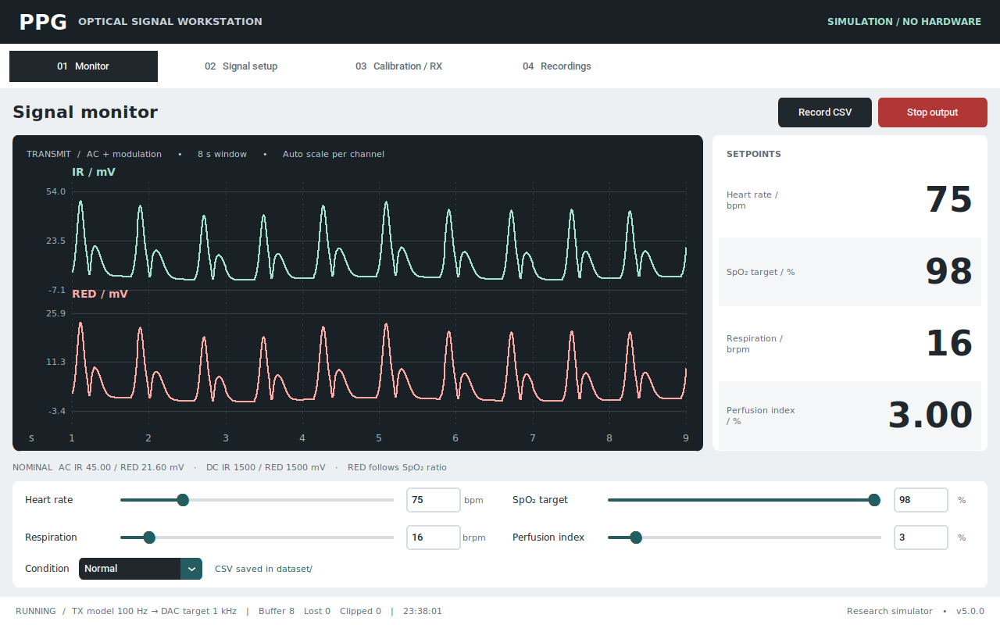
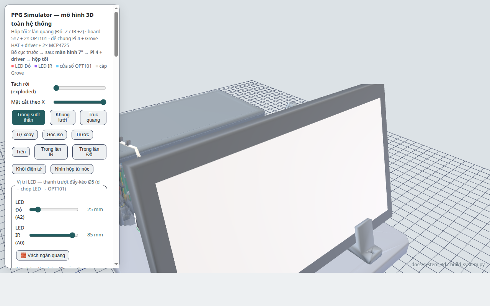

# 🫀 PPG Signal Simulator — Raspberry Pi 4

**Dual-channel PPG research simulator for Raspberry Pi and Linux desktop development**


**Group #2:** HuyNN, VyPT
**Institution:** Industrial University of Ho Chi Minh City (IUH) — Faculty of Electronic Technology
**Version:** 5.0.0 — Clinical-style monitor, complete waveform controls and timestamped recording

---

## 📋 Overview

The Raspberry Pi runtime synthesizes IR/RED signals at 100 Hz, interpolates them
for a nominal 1 kHz dual-MCP4725 output, and acquires OPT101 signals separately.
The empirical SpO₂ mapping is configurable; a realistic plot does not establish
optical accuracy or compatibility with a particular pulse oximeter.



### What's complete in v5

- Light controls, charcoal IR/RED plots, large setpoints, timestamp axes and a 1024×600 minimum layout.
- HR 10–300 bpm; respiration 1–150 brpm; SpO₂ target 0–100%; PI convenience input 0.01–30%.
- Independent IR/RED AC and DC, AC/DC ownership, output offset, gain and polarity.
- PPG, sine, triangle and square waveforms; independent SP/DN/DP timing for each channel.
- Baseline, amplitude and frequency respiratory modulation, inhale/exhale ratio, per-channel variation and periodic apnea.
- Absolute-mV artefacts with optional seeds; configurable HR/amplitude, SpO₂/notch and beat-variability effects.
- Timestamped 100 Hz model-command CSV recording continues across pages; playback follows the recorded timestamps.
- Explicit Start/Stop for calibration; only the engine's DAC thread produces its sine output.
- Configuration round-trip, validation and atomic JSON save. Opening a page does not change signal parameters.

See [the continuation and validation report](docs/phase_reports/V5_CONTINUATION_REPORT.md)
for scope, evidence, commercial-reference comparison and physical validation still needed.

### Key Specifications

| Parameter               | Value                                           |
|------------------------|-------------------------------------------------|
| Platform               | Raspberry Pi 4 (Ubuntu 24.04/26.04 LTS, arm64)  |
| UI Library             | CustomTkinter                                   |
| DAC                    | MCP4725 (12-bit, I2C) × 2 — IR & Red channels   |
| Model Rate             | 100 Hz                                          |
| DAC Rate               | 1 kHz target; Linux/I²C timing requires measurement |
| Data Recording         | 100 Hz model commands, timestamped CSV in `dataset/` |
| DAC Voltage Range      | Configured 0–3.28 V (0 → 0, 3.28 V → 4095) |

---

## 🛠️ Hardware Architecture

### Pin Mapping (Raspberry Pi 4, BCM numbering)

```
MCP4725 DACs (I2C Bus 1):
  GPIO2 (pin 3)   → I2C1_SDA
  GPIO3 (pin 5)   → I2C1_SCL
  Addresses: 0x60 (IR channel), 0x61 (Red channel)

Display:
  HDMI → Any screen (auto-detect resolution)
```

### Mechanical enclosure (3D)

The dark-chamber enclosure, its parametric build script and the printable STLs
live in [`docs/system_3d/`](docs/system_3d/README.md).



> **The IR lane has no STLs of its own — this is deliberate, not a missing
> export.** The two optical lanes are mirror-symmetric about z = 0, so the
> `slide_shaft`, `led_carrier`, `rod_knob`, `aperture_*` and `hood_*` parts are
> exported once under the `_red` name and printed twice (the `*_ir` copies exist
> in `model.json` for the viewer only). Print counts are in the STL table of the
> `docs/system_3d/` README.

---

## 💻 Software Architecture

### Folder Structure

```
PPG_simulator_raspi/
├── main.py                      # Application entry point
├── config.py                    # Constants & Styles
├── config_store.py              # JSON config persistence
├── core/
│   ├── signal_engine.py         # Signal generation thread + DAC output
│   ├── csv_logger.py            # Dataset recording logic
│   ├── tx_rx_logger.py          # TX/RX paired acquisition logging
│   ├── rate_scheduler.py        # Drift-free fixed-rate ticker
│   └── state_machine.py         # System state machine
├── models/
│   ├── ppg_model.py             # PPG physiological model logic
│   ├── noise.py                 # Artefact sources (absolute-mV, band-limited)
│   ├── respiration.py           # Respiratory modulation and apnea
│   ├── waveform.py              # Pulse morphology and test waveforms
│   └── limits.py                # Shared parameter ranges
├── led_driver/                  # Op-amp + BJT current-sink design calculations
├── ui/
│   ├── ctk_app.py               # Main CustomTkinter Application
│   ├── advanced_controls.py     # Parse/validate/dispatch for Signal Setup
│   └── frames/
│       ├── pathology_frame.py   # Main simulation & sliders
│       ├── calibration_frame.py # Sine wave generator
│       ├── advanced_frame.py    # Signal Setup tab (AC/DC, SpO2 cal, artefact)
│       └── playback_frame.py    # Data file browser & viewer
└── dataset/                     # Folder where recordings are stored
```

---

## 🔧 Installation & Setup

### 1. Prerequisites
- Raspberry Pi 4 with Ubuntu 24.04 or 26.04 LTS (aarch64)
- I2C enabled (`dtparam=i2c_arm=on` in `/boot/firmware/config.txt`; the setup
  script can add it after confirmation)
- Python 3.10+ and OS package `python3-tk`; install dependencies inside a venv.

For Ubuntu, use the repository setup script instead of installing into the
system Python:

```bash
./scripts/setup_rpi_ubuntu.sh --enable-i2c
```

For a laptop-to-Pi Ethernet cable, source transfer, repeatable `ping`/`ssh`
commands, and remote debugging, follow
[docs/setup/RASPBERRY_PI_4_UBUNTU_26_04_SSH.md](docs/setup/RASPBERRY_PI_4_UBUNTU_26_04_SSH.md).

### 2. Laptop setup, run and tests

```bash
python3 -m venv .venv
.venv/bin/python -m pip install --upgrade -r requirements/test.txt
.venv/bin/python main.py --dry-run
PPG_DRY_RUN=1 .venv/bin/python -m pytest -q
```

On the configured Raspberry Pi, use `.venv/bin/python main.py` for hardware mode.
Virtual environments are deliberately excluded from Git; recreate one on each
machine because wheels and interpreter paths are architecture-specific.

GUI interaction and screenshot check (requires a real display or Xvfb):

```bash
.venv/bin/python scripts/smoke_ui.py --output docs/ui
```

The laptop environment verifier also audits Git hygiene and rejects committed
virtual environments, bytecode and generated package caches.

---

## Operation

**Monitor:** adjust HR, SpO₂ target, respiration and PI with sliders, or type a
value and press Enter. Run starts TX; Stop parks both DAC command values at zero.
Record CSV starts capture; Save recording closes the file into `dataset/data_N.csv`.
Closing the app saves an active recording. The plotted signal is generated TX,
not an optical measurement. The right-hand numbers are setpoints.

**Signal setup:** each tab applies only when its Apply button is pressed.
Blank RED AC derives it from SpO₂. Explicit RED AC disconnects that amplitude
from the SpO₂ target and the monitor reports this. Lock AC holds AC while a PI
change moves IR DC; Lock DC lets PI move AC; both locks make PI read-only.
Feature times are quoted at 60 bpm and scale with cycle duration.

For a repeatable nominal waveform, disable respiratory modulation and all three
physiological dynamics switches on the Respiration tab. Otherwise modulation,
HR coupling and beat variability deliberately change the instantaneous AC/HR.

**Calibration / RX:** enter sine frequency (1–10 Hz) and peak output (100–3280 mV),
then Start calibration. Opening the page alone does not start output. Leaving the
page stops an active calibration. OPT101 values are raw ADC-derived mV with
freshness/status; dry-run and disconnected inputs display no fabricated samples.

**Recordings:** review saved TX command CSVs without driving hardware. New files
contain `Time_s` and `Source`; the first seven columns retain the legacy schema.
Legacy files without timestamps explicitly assume 50 Hz for screen playback.
CSV output is a model command record, not proof that a DAC wrote every sample.

## Signal relationships and limits

`PI = AC_IR / DC_IR × 100`; at DC=1500 mV, PI=3% gives nominal AC=45 mV.
RED is derived with the full ratio-of-ratios:

`R = max(0, (A − SpO₂_target) / B)`

`AC_RED = R × AC_IR × DC_RED / DC_IR`

The defaults A=110 and B=25 are an empirical example, not universal optical
calibration. The former R clamp of 0.4–1.6 has been removed so low SpO₂ targets
change the generated ratio. A negative requested R cannot be synthesized; the
monitor reports it. Unequal respiration depth and manually pinned RED AC can
change the instantaneous ratio from the nominal target.

PPG uses a normalized three-Gaussian shape. Respiratory depth defaults to 4% of
AC per channel, with baseline/amplitude/RSA modulation individually selectable.
Apnea suppresses respiratory modulation while cardiac pulses continue.

Direct AC entry spans 0.1–300 mV and DC entry 100–3000 mV. PI-driven AC can exceed
the direct AC range; output offset spans 0–2000 mV with DC+offset≤3000 mV. Gain,
noise and modulation can still exceed DAC headroom: the output clamps to the
configured rails and the clipping counter reports it. A clipped waveform does
not meet the requested amplitude or ratio.

50/60 Hz mains noise is rejected by the 100 Hz synthesis model; 10× interpolation
does not create additional bandwidth. Likewise, the MCP4725 code step is about
0.80 mV at 3.28 V: software entry resolution is finer than physical DAC resolution.

The LED-driver topology in the supplied drawing is DAC → op-amp → NPN current
sink with emitter feedback through R_sense. The 3D preview defaults to this direct
command path, and offers the older 10k/10k divider hypothesis separately. Its
`I ≈ Vcmd/R` readout is an ideal estimate; current, compliance and optical response
must be measured on the actual assembly. No wiring, transistor or resistor is
changed by this software update.

## 👨‍💻 Authors

**HuyNN** — Hardware design, embedded firmware  
**VyPT** — Software design, UI/UX

**Institution:** Industrial University of Ho Chi Minh City (IUH)
