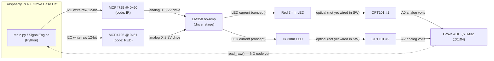
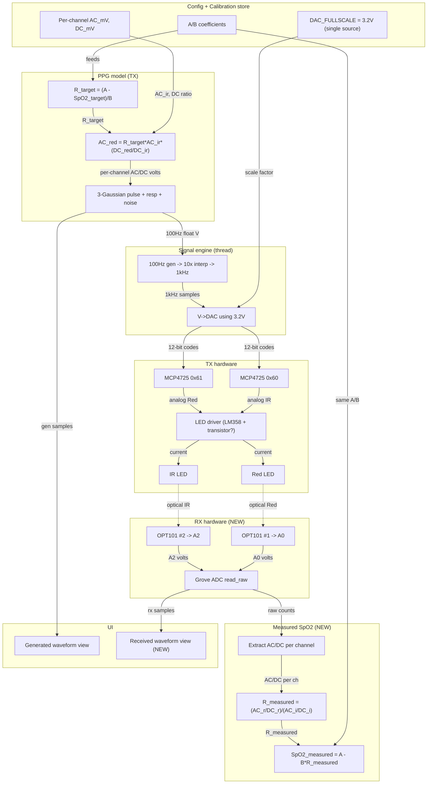
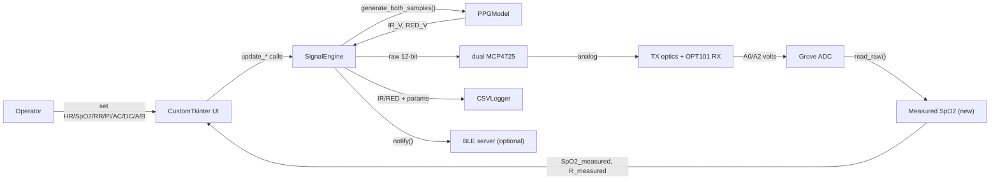
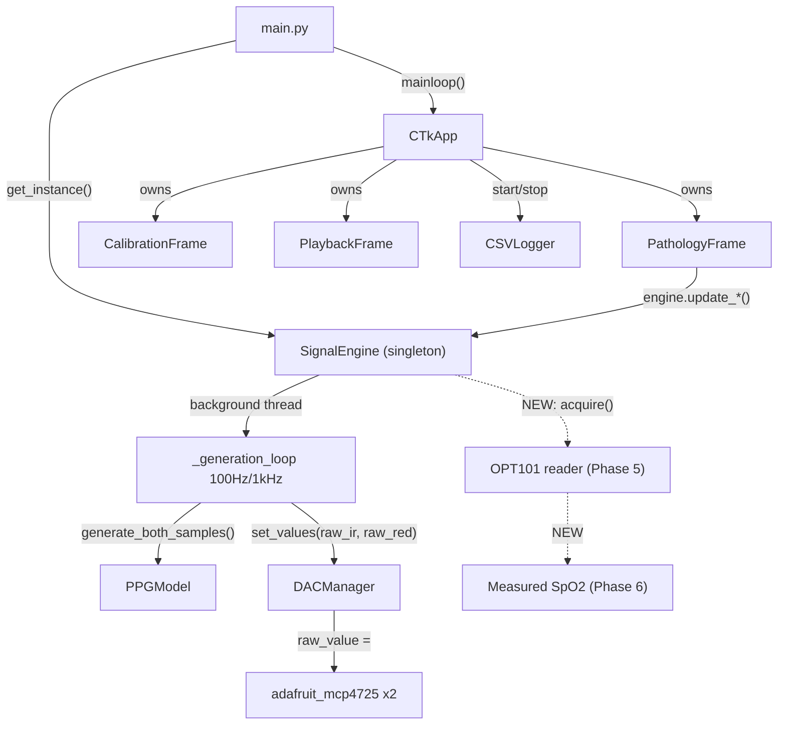
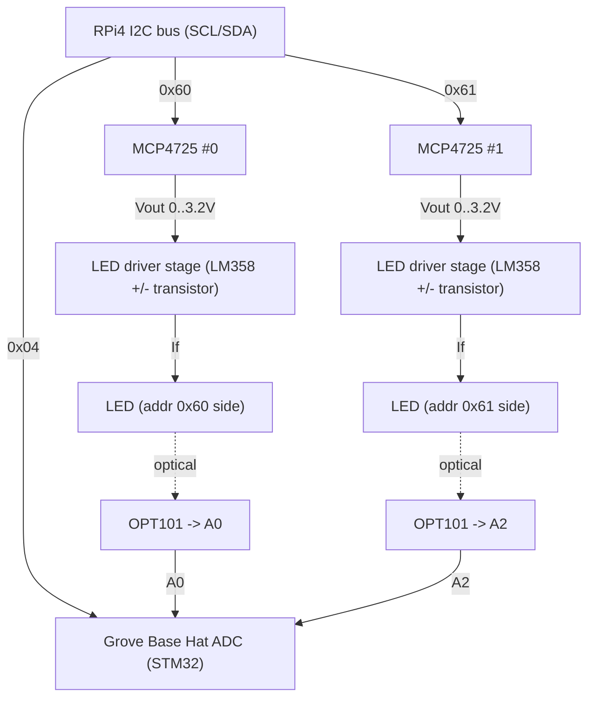
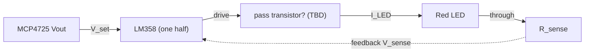

# Phase 1 — Reference Audit and Master System Design

**Project:** PPG / SpO2 Simulator on Raspberry Pi 4
**Reference device:** WhaleTeq AECG100 (PPG/SpO2 subsystem only)
**Engineering target:** ~80–90% *functional* similarity of the PPG/SpO2 subsystem — **not** the full ECG/PWTT product, and **not** clinical equivalence.
**Phase constraint:** No source code was modified in Phase 1. This document is analysis and design only.

> **Evidence discipline used throughout this report.** Every claim is tagged:
> **[VERIFIED-CODE]** = read directly from project source (file:line cited); **[VERIFIED-PDF]** = read directly from a reference PDF (page/section cited); **[VERIFIED-USER]** = user-confirmed hardware fact; **[INFERENCE]** = engineering deduction from verified facts; **[UNKNOWN]** = not determinable from currently available evidence. Where evidence is insufficient, the report states verbatim: *I am not sure based on the currently available evidence.*

---

## 1. Executive summary

The existing project is a **functional, single-channel-minded PPG/SpO2 waveform generator** that already produces dual Red/IR analog waveforms through two MCP4725 DACs and displays them in a CustomTkinter GUI. Its waveform synthesis (3-Gaussian pulse, respiration BM/AM/FM modulation, HR/PI/SpO2/RR/noise parameters) is well structured and close in spirit to the AECG100 PPG generator. **[VERIFIED-CODE]** ([models/ppg_model.py](../../models/ppg_model.py), [core/signal_engine.py](../../core/signal_engine.py), [hw/dac_manager.py](../../hw/dac_manager.py))

However, measured against the AECG100 PPG/SpO2 feature set, there are **five structural gaps** that block the 80–90% target:

1. **DAC voltage source-of-truth is wrong and duplicated.** Code hardcodes `3.3 V` full-scale in at least four places, but the **measured** full-scale is `3.2 V`. This introduces a fixed ~3% amplitude/level error on every generated AC/DC value. **[VERIFIED-CODE + VERIFIED-USER]**
2. **The SpO2 model is inverted vs. the AECG100 mental model.** The AECG100 lets the user set **AC and DC in mV per channel** and derives PI and R; the current code takes **PI as the input**, derives a single AC, and shares **one** DC baseline (`1.5 V`) across both channels. The ratio-of-ratios therefore collapses to `AC_red = R·AC_ir`, which is only valid because `DC_red == DC_ir`. **[VERIFIED-CODE]**
3. **The SpO2 calibration equation `SpO2 = A − B·R` is hardcoded** (`A=110`, `B=25`) in two places and is **not user-adjustable**. The AECG100 default is exactly `110.0 − 25.0·R` but exposes adjustable intercept/slope. **[VERIFIED-CODE + VERIFIED-PDF]**
4. **There is no receive (RX) path at all.** Two OPT101 modules exist physically (A0, A2) but there is **no acquisition code**; the only ADC code is deprecated and reads a single channel as a potentiometer. No measured-SpO2 loop exists. **[VERIFIED-CODE + VERIFIED-USER]**
5. **Configuration persistence and the reference control surface are incomplete.** `config_store` persists only 8 waveform parameters; it saves no A/B, no per-channel AC/DC(mV), no RX config. Reference features such as *AC-above/below-DC*, per-channel DC lock, and selectable single Wave-Modulation mode are absent. **[VERIFIED-CODE + VERIFIED-PDF]**

**Bottom line:** the transmit-side waveform generator is a solid ~60–70% match in *waveform behavior*, but the **SpO2 measurement architecture, calibration adjustability, RX acquisition, and voltage correctness** must be built/fixed to reach the stated engineering target. This report defines the target architecture, the exact math, the TX/RX circuit concept, the BOM, the phased plan, the files to touch (and not touch), tests, and acceptance criteria. **No clinical-grade claim is made anywhere.**

---

## 2. AECG100 relevant PPG/SpO2 feature summary (reference behavior)

Scope: only PPG/SpO2-relevant behavior. ECG/PWTT excluded except where architecture is shared.

- **PPG generator** outputs analog PPG on Red and IR channels with configurable **AC and DC levels in mV**, **PI = AC/DC**, heart rate, respiration, and noise. **[VERIFIED-PDF]** (user_manual Table 7; version_sdk `PPG_WAVEFORM`)
- **SpO2 mode** default equation **`SpO2(%) = 110.0 − 25.0 · R`** (Webster linear), with **adjustable intercept/slope** and optional quadratic (Degree-2) mapping. **[VERIFIED-PDF]** (user_manual §4.6; Fig 74 `SpO2 = 112.7 − 20.1·R − 10.5·R²`; Fig 81 `SpO2 = 111.1 − 22.6·R`)
- **Ratio of ratios** `R = (AC_red/DC_red)/(AC_ir/DC_ir)`; documented worked example Red PI 2.000% (AC 12.50 mV / DC 625 mV), IR PI 4.000% (AC 25.00 mV / DC 625 mV) → `R = 0.5` → `SpO2 = 97.5% ≈ 98%`. Note both DC equal (625 mV), so the simplified form is valid there. **[VERIFIED-PDF]** (user_manual Table 10 + §4.6 example)
- **Wavelengths:** Red 660 nm, IR 940 nm (also 525/880 nm modules). Red irradiance 3.55 mW/m² ±15%, IR 6.65 mW/m² ±15%. **[VERIFIED-PDF]** (Table 9; whale_device module list PPG-1R-525 / PPG-2TF-660 / PPG-2R-880 / PPG-2R-940)
- **Respiration** as one selectable **Wave Modulation** mode: **Baseline / Amplitude / Frequency** (BM/AM/FM), with Variation-R/IR 1–16% (default 1%), Resp Rate 1–150 (default 20), Inhale:Exhale 1:1…1:5, Apnea. **[VERIFIED-PDF]** (Table 7)
- **Noise:** selectable frequency (Off / 0.5 / 1 / 2 / 3 / 5 / 10 / 25 Hz, White) added in SDK v1.0.3.3; amplitude 0.05–2.00 (default off). **[VERIFIED-PDF]** (version_sdk changelog; Table 7)
- **AC-above-DC / AC-below-DC** polarity setting; AC-below-DC is the power-on default (in that mode DC tracks AC even with *Lock DC* enabled). **[VERIFIED-PDF]** (user_manual §4.1.1, Fig 22/23)
- **PD sampling** 250 kHz; **LED scan** 50 Hz–40 kHz (time-division LED switching implied). **[VERIFIED-PDF]** (Table 6)
- **Waveform display + save/recall/player**; raw-data scaling `[Data Value/(Max−Min)] × Max AC Level`, up to 131,072 samples/signal. **[VERIFIED-PDF]** (user_manual raw-data + player sections)
- **Calibration/validation workflow:** against Masimo Radical-7 / Covidien Nellcor, or electrical LED-PD reference; recommended yearly. Device is explicitly **"a professional testing instrument… not for clinical use."** **[VERIFIED-PDF]** (user_manual §6, §8(9))

---

## 3. PDF reference evidence table

| # | Source PDF | Page / Section | Exact verified value | Relevance to this project |
|---|-----------|----------------|----------------------|---------------------------|
| E1 | user_manual.pdf | §4.6 SpO2 Mode | `SpO2(%) = 110.0 − 25.0 × R` (default, Webster); intercept + slope adjustable | Defines the default and the requirement for **adjustable A/B** |
| E2 | user_manual.pdf | Fig 74 (Auto Test) | `SpO2 = 112.7 − 20.1·R − 10.5·R²` | Confirms **quadratic (Degree-2)** option exists |
| E3 | user_manual.pdf | Fig 81 | `SpO2 = 111.1 − 22.6·R` | Confirms A/B are genuinely varied per calibration |
| E4 | user_manual.pdf | Table 10 (SpO2 params) | SpO2 def 98%; Red PI 2.000% / AC 12.50 mV / DC 625 mV; IR PI 4.000% / AC 25.00 mV / DC 625 mV; note `OutputDC + DC ≤ 3000 mV` | Target uses **per-channel AC/DC in mV**; validates R=0.5 example |
| E5 | user_manual.pdf | §4.6 worked example | R=0.5 → SpO2 97.5% ≈ 98% | End-to-end math check; both DC equal → simplified R valid |
| E6 | user_manual.pdf | Table 7 (PPG params) | BPM def 60; PI 0.025–30% def 2.000%; DC 100–3000 def 625 mV; SP(AC) def 12.50; Resp Rate 1–150 def 20; Inhale:Exhale 1:1..1:5; Variation-R/IR 1–16% def 1%; Wave Modulation = Baseline/Amplitude/Frequency; Apnea 1–60 s | Reference parameter ranges/defaults for the target control surface |
| E7 | user_manual.pdf | Table 6 (PPG spec, Reflectance) | HR 10–300 ±1 BPM; LED DC 100–3000 mV; LED AC 0.75–30 mV; wavelength 525/660/880/940 nm ±10 nm; LED scan 50 Hz–40 kHz; PD sample 250 kHz | Reference electrical ranges; informs feasibility vs. our DAC/ADC |
| E8 | user_manual.pdf | Table 9 (SpO2 spec) | Red 660 nm / IR 940 nm / 880 nm ±10 nm; Red irradiance 3.55 mW/m² ±15%; IR 6.65 mW/m² ±15%; SpO2 1–100% ±1% + DUT | Wavelength targets; **our LED wavelengths remain unverified** |
| E9 | user_manual.pdf | §4.1.1 PPG Config | Inverted; Synchronized Pulse; Trigger Level; Ambient Light (Off/Indoor 50 Hz/60 Hz/1 K–10 KHz/DC/Sun); AC above DC / AC below DC (AC-below-DC = power-on default) | Reference features missing from current code (polarity, ambient) |
| E10 | user_manual.pdf | Raw-data / player | Scaling `[Data Value/(Max−Min)] × Max AC Level`; max 131,072 samples/signal | Informs CSV/playback format alignment |
| E11 | user_manual.pdf | §6 Calibration | Masimo Radical-7 / Covidien Nellcor / electrical LED-PD; yearly | Calibration workflow reference |
| E12 | user_manual.pdf | §8(9) | "professional testing instrument… not for clinical use" | We must not claim clinical grade |
| E13 | version_sdk_app_whale.pdf | changelog v1.0.3.3 | PPG noise frequencies 0.5/1/2/3/5/10/25 Hz added | Reference noise model |
| E14 | version_sdk_app_whale.pdf | `PPG_WAVEFORM` struct | Fields: RespirationMode, RespirationVariation, RespirationInExhaleRatio, RespirationRate, RespirationAmplitude, ACOffset, AmbientLight(removed) | Confirms respiration is **one selectable mode**, plus ACOffset |
| E15 | version_sdk_app_whale.pdf | notes | "adjust DC levels to make PI more accurate"; test env Linux 6.8.0-49 Ubuntu, RPi4 4 GB | Confirms DC is a first-class control; our platform matches |
| E16 | whale_device.pdf | datasheet v2.1 | Modules PPG-1R-525, PPG-2TF-660, PPG-2R-880, PPG-2R-940; standards IEC 60601-2-47, IEC 63203-402-3:2024, YY 0885, YY 9706.247; SDK DLL/C/C++/C# | Reference device scope/wavelengths |

---

## 4. Current codebase architecture

### 4.1 Module map (active runtime path)

| Layer | File | Role | Status |
|-------|------|------|--------|
| Entry | [main.py](../../main.py) | Parse `--dry-run`, build `SignalEngine` singleton, call `engine.begin()`, launch `CTkApp().mainloop()` | Active |
| Config | [config.py](../../config.py) | All constants; DAC addresses, rates, voltages | Active |
| Config persist | [config_store.py](../../config_store.py) | JSON load/save of 8 params | Active |
| Model | [models/ppg_model.py](../../models/ppg_model.py) | Waveform synthesis, SpO2/AC/DC/PI math | Active |
| Engine | [core/signal_engine.py](../../core/signal_engine.py) | Singleton; one background thread; interpolation; DAC push | Active |
| DAC HW | [hw/dac_manager.py](../../hw/dac_manager.py) | Dual MCP4725 driver | Active |
| UI | [ui/ctk_app.py](../../ui/ctk_app.py) | CustomTkinter root, 3 frames, 50 Hz GUI loop | Active |
| UI | [ui/frames/pathology_frame.py](../../ui/frames/pathology_frame.py) | Main controls + generated waveform plot | Active |
| UI | [ui/frames/calibration_frame.py](../../ui/frames/calibration_frame.py) | DAC sine amplitude test output | Active |
| UI | [ui/frames/playback_frame.py](../../ui/frames/playback_frame.py) | CSV replay | Active |
| Logging | [core/csv_logger.py](../../core/csv_logger.py) | Record IR/RED raw + params to CSV | Active (via ctk_app) |
| State | [core/state_machine.py](../../core/state_machine.py) | INIT→SELECT→SIMULATING↔PAUSED FSM | Imported by ctk_app; largely vestigial with slider UI |
| Comm | [comm/ble_server.py](../../comm/ble_server.py) | BLE peripheral via `bless` | Present |
| Comm | [comm/logger.py](../../comm/logger.py) | Shared logger | Active |

**Dead / unused in the runtime path (verified by import grep):**
- [core/param_controller.py](../../core/param_controller.py) — nothing imports it; the pathology UI calls `engine.update_*` directly. **[VERIFIED-CODE]**
- [core/digital_filters.py](../../core/digital_filters.py) — nothing imports it; `SignalFilterChain.enabled = False` by default ([digital_filters.py:121](../../core/digital_filters.py#L121)). **[VERIFIED-CODE]**
- [hw/adc_reader.py](../../hw/adc_reader.py) — file header says **"DEPRECATED: no longer used"**; reads a single channel (A0) as a potentiometer. **[VERIFIED-CODE]**
- [hw/button_handler.py](../../hw/button_handler.py) — GPIO buttons (`RPi.GPIO` with `lgpio` fallback); vestigial with the GUI.

### 4.2 Thread / timing model **[VERIFIED-CODE]**

- **One** daemon background thread (`_generation_loop`) in [core/signal_engine.py](../../core/signal_engine.py).
- Model waveform generated at `MODEL_SAMPLE_RATE_PPG = 100 Hz` ([config.py:71](../../config.py#L71)); each model sample is **10× linearly interpolated** (`UPSAMPLE_RATIO_PPG = 10`, [config.py:80](../../config.py#L80)) and pushed to the DAC at `FS_TIMER_HZ = 1000 Hz` ([config.py:65](../../config.py#L65)).
- Ring buffers of `SIGNAL_BUFFER_SIZE = 1024` ([config.py:111](../../config.py#L111)).
- GUI updates at 50 Hz via `self.after(20, …)` in [ui/ctk_app.py](../../ui/ctk_app.py).

### 4.3 Current SpO2 / AC / DC / PI relationship **[VERIFIED-CODE]** — this is the core architectural gap

In [models/ppg_model.py](../../models/ppg_model.py):
- `PPG_AC_SCALE_PER_PI = 0.015` V per PI% ([ppg_model.py:38](../../models/ppg_model.py#L38)).
- `self.dc_baseline = 1.5` — **a single DC shared by both channels** ([ppg_model.py:191](../../models/ppg_model.py#L191)).
- `r_value = clamp((110.0 − spo2)/25.0, 0.4, 1.6)` — **A=110, B=25 hardcoded** ([ppg_model.py:451](../../models/ppg_model.py#L451)).
- `ac_ir = current_pi × 0.015; ac_red = ac_ir × r_value` ([ppg_model.py:452-453](../../models/ppg_model.py#L452-L453)).
- Duplicate hardcoded R in the UI: `r_val = max(0.4, min(1.6, (110.0 − spo2)/25.0)); ac_red_v = ac_ir_v × r_val` ([pathology_frame.py:243-244](../../ui/frames/pathology_frame.py#L243-L244)).

**Interpretation:** the current design is **PI-in → AC-out**, single shared DC, and A/B fixed. The reference design is **AC/DC(mV)-in → PI-out**, per-channel DC, A/B adjustable. Because both channels currently share DC, the model uses the simplified `AC_red = R·AC_ir`, which is only mathematically valid while `DC_red == DC_ir`.

### 4.4 DAC voltage handling **[VERIFIED-CODE]** — the 3.2 V vs 3.3 V defect

Hardcoded `3.3 V` full-scale appears in at least four places, conflicting with the measured `3.2 V`:
- [config.py:88](../../config.py#L88): `DAC_VOLTAGE_MAX = 3.3` (comment "MCP4725 VDD = 3.3V").
- [core/signal_engine.py:143-154](../../core/signal_engine.py#L143-L154): `dac_val = int((signal_v / 3.3) * 4095.0)`.
- [models/ppg_model.py:507-509](../../models/ppg_model.py#L507-L509): `clamp(signal_ir, 0.0, 3.3)`.
- [ui/frames/calibration_frame.py:96](../../ui/frames/calibration_frame.py#L96): `dac_val = int(val_mv / 3300.0 * 4095)`.

Also `ADC_VOLTAGE_REF = 3.3` ([config.py:123](../../config.py#L123)) — relevant later for RX scaling.

---

## 5. Current hardware architecture **[VERIFIED-USER + VERIFIED-CODE]**

- **Raspberry Pi 4** (Ubuntu 24.04 LTS) + **Seeed Grove Base Hat**.
- **2× MCP4725** 12-bit I2C DAC at `0x60` and `0x61`. Code maps `DAC_ADDR_IR = 0x60`, `DAC_ADDR_RED = 0x61` ([config.py:43-44](../../config.py#L43-L44)) — **comment-level mapping only; the physical Red/IR-to-address wiring is not verified.**
- **Measured DAC full-scale = 3.2 V** (user-confirmed; overrides the 3.3 V in code).
- **LM358** dual op-amp; **3 mm Red LED**; **3 mm IR LED** (wavelengths unverified).
- **2× OPT101** photodetector modules available; RX ch.1 → Grove ADC **A0**, RX ch.2 → **A2**. **No OPT101 acquisition code exists.**
- Grove Base Hat ADC = STM32 co-processor at I2C `0x04`; real API `grove.adc.ADC().read_raw(channel)` ([hw/adc_reader.py:44-47](../../hw/adc_reader.py#L44-L47)). Current code reads only `GROVE_ADC_CHANNEL = 0` (A0); **A2 is not defined in config**. **[VERIFIED-CODE]**


*Arrow meanings:* solid `-->` = implemented data/signal path; dotted `-.->` = physically possible but **not implemented in software** (RX acquisition missing).

---

## 6. Reference-vs-current gap matrix

| # | Feature | AECG100 reference **[VERIFIED-PDF]** | Current project **[VERIFIED-CODE]** | Gap severity | Target phase |
|---|---------|-------------------------------------|-------------------------------------|--------------|--------------|
| G1 | DAC full-scale truth | N/A (device internal) | Hardcoded 3.3 V in ≥4 places; measured 3.2 V | **High** (systematic ~3% error) | 2/4 |
| G2 | SpO2 equation `A − B·R` | Default 110/25, **adjustable** A/B, Degree-2 option | Hardcoded 110/25 in 2 places, not adjustable | **High** | 2 |
| G3 | AC/DC control | Per-channel **AC & DC in mV**, PI=AC/DC | PI-in, AC derived, single shared DC=1.5 V | **High** | 3 |
| G4 | Ratio of ratios | Full `R=(AC_r/DC_r)/(AC_i/DC_i)` | Simplified `AC_red=R·AC_ir` (valid only DC_r=DC_i) | **High** | 3 |
| G5 | RX acquisition (OPT101) | PD sampling, measured signal | **None** — adc_reader deprecated, A0-only, potentiometer | **High** | 5 |
| G6 | Measured SpO2 loop | `SpO2 = A − B·R_measured` | **None** | **High** | 6 |
| G7 | Received waveform display | Yes | **None** (only generated shown) | Medium | 7 |
| G8 | Respiration modes | Selectable single BM/AM/FM + variation/I:E/apnea | BM/AM/FM **all always-on** simultaneously | Medium | 3 |
| G9 | AC above/below DC polarity | Selectable; AC-below-DC power-on default | Not present | Medium | 3/7 |
| G10 | Noise model | Selectable freq set + amplitude | Single broadband `noise` 0–1, no freq selection | Medium | 3 |
| G11 | Config persistence | Full param set incl. AC/DC/A/B | Only 8 params; no A/B, AC/DC(mV), RX | Medium | 2 |
| G12 | DAC simultaneity | (device internal) | Sequential IR-then-Red writes | Low–Medium | 4 |
| G13 | Wavelength labeling | 660 nm / 940 nm ±10 nm | LEDs unverified; A0/A2 & 0x60/0x61 Red/IR mapping unverified | Medium (blocks correct labeling) | 4/5 |
| G14 | Calibration workflow | Masimo/Nellcor/electrical, yearly | None documented | Medium | 10 |
| G15 | Dependency manifest | N/A | `requirements.txt` lists pygame (stale), omits customtkinter | Low | 2 |

---

## 7. Target system architecture


*Arrow meanings:* `-->` = data/control flow implemented in software; `-.->` = optical coupling in hardware. The **same A/B** feeds both target generation and measured mapping (dual use). Red/IR-to-address and A0/A2-to-wavelength labels are **provisional** until wiring is verified (see §16).

---

## 8. System block diagram


*Arrow meanings:* labels state the payload crossing each boundary.

---

## 9. Software architecture diagram


*Arrow meanings:* `-->` current calls (verified in source); `-.->` new modules introduced in later phases. Note: `param_controller` and `digital_filters` are **not** in this active graph (unused today).

---

## 10. Hardware architecture diagram


*Arrow meanings:* `-->` electrical; `-.->` optical. LED wavelength labels intentionally omitted (unverified). Which DAC address drives which physical LED is **unverified** — see §16.

---

## 11. Complete end-to-end data pipeline

**TX (implemented today):**
1. Operator sets parameters → `PathologyFrame` → `engine.update_*` → `PPGModel` state. **[VERIFIED-CODE]**
2. Background thread: `PPGModel.generate_both_samples(dt)` at 100 Hz returns IR/RED in **volts** (variable names say `_mv` but values are volts — see [signal_engine.py:180](../../core/signal_engine.py#L180)). **[VERIFIED-CODE]**
3. 10× linear interpolation between successive 100 Hz samples → 1000 Hz stream.
4. `_v_to_dac()` scales volts → 12-bit code (**currently ÷3.3; must become ÷3.2**).
5. `DACManager.set_values(raw_ir, raw_red)` → sequential `raw_value` writes to `0x60` then `0x61`. **[VERIFIED-CODE]**

**RX (to be built, Phases 5–6):**
6. `grove.adc.ADC().read_raw(0)` and `read_raw(2)` sample OPT101 outputs on A0/A2.
7. Convert raw counts → volts using `ADC_VOLTAGE_REF`.
8. Separate AC (pulsatile) and DC (baseline) per channel.
9. `R_measured = (AC_r/DC_r)/(AC_i/DC_i)`; `SpO2_measured = A − B·R_measured`.
10. Display measured waveform + SpO2 next to the generated ones.

**Timing budget check [INFERENCE]:** at 1 kHz DAC updates, the per-sample budget is 1 ms. Two sequential MCP4725 I2C writes at 400 kHz (~each transaction ≈ 3 bytes ≈ tens of µs plus Blinka/Linux overhead) are plausible within 1 ms, but **Linux userspace jitter is unmeasured** — flagged as an unknown requiring measurement (§16, and Phase 4/8 logic-analyzer plan).

---

## 12. Red transmitter block / circuit concept

**Concept (not a validated schematic):** DAC voltage → voltage-to-current converter → Red LED.

- MCP4725 output is a **buffered voltage source**, not a current source; an LED needs controlled **current**. **[INFERENCE from datasheet-class knowledge; component values not invented.]**
- A standard prototype approach is an **op-amp + series sense resistor + pass transistor** (op-amp forces `V_sense = V_DAC` across R_sense, setting `I_LED = V_DAC / R_sense`).
- Whether the **LM358 alone** can source the needed LED current directly, or needs an external transistor/MOSFET, depends on the target LED current and LM358 output drive — **I am not sure based on the currently available evidence** (LED forward current/voltage not verified). This is resolved in Phase 4 with datasheet + bench measurement.


*Arrow meanings:* forward drive solid; `-.->` = negative feedback that regulates current. "TBD" = component not yet chosen; values must come from LED datasheet, not invented.

## 13. IR transmitter block / circuit concept

Identical topology to §12 with the IR LED and the second LM358 half / second DAC. IR LED forward voltage typically differs from Red, so **R_sense and headroom must be recomputed per channel** once the LED parts are known. **[INFERENCE]** No component values asserted here.

---

## 14. Red / IR OPT101 receiver paths

**OPT101 = monolithic photodiode + transimpedance amplifier**, single-supply, voltage output proportional to incident light. **[INFERENCE — general part class; exact module variant/gain resistor not verified from project evidence.]**


- **Red RX path:** OPT101 → A0 (RX ch.1). **IR RX path:** OPT101 → A2 (RX ch.2). **But which wavelength each OPT101 actually sees is unverified** (§16). **[VERIFIED-USER for A0/A2 channel assignment; UNKNOWN for wavelength mapping]**
- Design concerns to resolve in Phase 5: OPT101 supply/output range vs Grove ADC input range, **saturation**, bandwidth vs pulse rate, **ambient light**, **Red↔IR optical crosstalk** (may require **time-division multiplexing** of the two LEDs, matching the AECG100 LED-scan concept), shielding/optical filtering. No claim that crosstalk is currently handled.

---

## 15. I2C topology, ADC topology, power/ground, timing/thread, UI

### 15.1 I2C topology **[VERIFIED-CODE]**
Single I2C bus (`busio.I2C(board.SCL, board.SDA)`, [dac_manager.py:38](../../hw/dac_manager.py#L38)) shared by: MCP4725 `0x60`, MCP4725 `0x61`, Grove ADC `0x04`. No address conflicts. Bus contention between DAC writes (1 kHz) and future ADC reads must be scheduled (Phase 5/8).

### 15.2 ADC topology **[VERIFIED-CODE + VERIFIED-USER]**
Grove Base Hat ADC via `grove.adc.ADC().read_raw(channel)`. Confirmed inputs: **A0** (RX ch.1), **A2** (RX ch.2). `config.py` currently defines only `GROVE_ADC_CHANNEL = 0`; **A2 must be added** in Phase 5. `ADC_MAX_VALUE = 4095`, `ADC_VOLTAGE_REF = 3.3` ([config.py:122-123](../../config.py#L122-L123)) — the 3.3 V ref here is the ADC reference and must be verified independently of the DAC 3.2 V fix.

### 15.3 Power / ground plan [INFERENCE]
Common ground between RPi/Grove Hat, both DACs, LM358, LEDs, and OPT101 is required for valid analog levels. Actual supply rails for LM358/OPT101 (3.3 V vs 5 V) are **not verified from project evidence** — *I am not sure based on the currently available evidence.* Resolve in Phase 4/5.

### 15.4 Timing / thread architecture **[VERIFIED-CODE]**
One daemon generation thread (100 Hz model, 10× interp, 1 kHz DAC); UI on the Tk main thread at 50 Hz. Future RX sampling should either share the generation thread or use a dedicated RX thread with careful I2C serialization (Phase 5/8).

### 15.5 UI architecture **[VERIFIED-CODE]**
CustomTkinter root with three frames (Pathology, Calibration, Playback), dark appearance default, 50 Hz `after(20,…)` redraw. Pathology sliders: HR 20–300, SpO2 70–100, RR 4–60, PI 0.0–20.0, Noise 0.0–1.0 (note: some slider ranges exceed the model's internal clamps, e.g. HR clamps 40–180 in `set_heart_rate`). No received-waveform view yet.

---

## 16. Unknowns requiring physical measurement

1. **Red/IR ↔ DAC address mapping** (which of `0x60`/`0x61` physically drives Red vs IR). Code comments claim IR=0x60/Red=0x61 but wiring is unverified. → *I am not sure based on the currently available evidence.*
2. **A0/A2 ↔ wavelength mapping** (which OPT101 sees Red vs IR). → *I am not sure based on the currently available evidence.*
3. **LED wavelengths** (is Red 660 nm? IR 940 nm?) — no part number/datasheet. → *I am not sure based on the currently available evidence.*
4. **LED forward voltage/current** and therefore R_sense and whether LM358 needs an external transistor.
5. **LM358 / OPT101 supply rails** and common-mode/output-swing headroom.
6. **Actual DAC LSB / linearity** at the measured 3.2 V full-scale (only full-scale is user-confirmed).
7. **1 kHz DAC timing jitter** under Linux userspace (needs logic-analyzer capture).
8. **OPT101 saturation / ambient / crosstalk** behavior in the real optical fixture.

---

## 17. SpO2 mathematical model (target)

**Target generation (device output):**
```
R_target = (A − SpO2_target) / B
R        = (AC_red/DC_red) / (AC_ir/DC_ir)
AC_red   = R_target · AC_ir · (DC_red / DC_ir)
```
Simplify to `AC_red = R_target · AC_ir` **only when `DC_red == DC_ir`.** Defaults A=110, B=25 reproduce the AECG100 default and the worked R=0.5→98% example. **[VERIFIED-PDF E1,E4,E5]**

**Measured SpO2 (RX):**
```
R_measured    = (AC_red_meas/DC_red_meas) / (AC_ir_meas/DC_ir_meas)
SpO2_measured = A − B · R_measured
```
Critical correctness note carried from the phase spec: **changing A or B only changes the numeric mapping unless the generator re-derives `R_target` (and hence Red/IR amplitudes) from the new A/B.** The target design wires A/B into *both* generation and measurement so the two stay consistent.

Optional Degree-2 mapping `SpO2 = A − B·R − C·R²` (from Fig 74) is supported as a later extension, not required for the base target.

---

## 18. AC / DC / PI model (target)

- Primary inputs become **per-channel AC (mV) and DC (mV)**; **PI = AC/DC** is *derived* (matching AECG100, E4/E6/E15). This inverts the current PI-in design.
- `DC_red` and `DC_ir` become **independent** (not a single 1.5 V), enabling the full ratio-of-ratios.
- Maintain a compatibility path: a PI-driven convenience input can still exist in the UI, but the model of record is AC/DC(mV).
- Enforce reference-style bounds (E4/E6): DC 100–3000 mV, AC ≤ 30 mV region, `OutputDC + DC ≤ 3000 mV`, scaled to our **3.2 V** full-scale headroom.

---

## 19. Configurable A/B calibration design

- Add `A`, `B` (and optional `C`) to the config schema and to `config_store` persistence (currently absent). **[VERIFIED-CODE gap: config_store persists only 8 params]**
- Single source of truth consumed by (a) `R_target` generation and (b) `SpO2_measured` mapping.
- UI controls for intercept/slope with sane defaults 110/25 and reference-derived ranges.
- Remove the two hardcoded duplicates ([ppg_model.py:451](../../models/ppg_model.py#L451), [pathology_frame.py:243](../../ui/frames/pathology_frame.py#L243)) in Phase 2, replacing with the shared coefficients.

---

## 20. Noise model (target)

Current: single broadband `noise` 0–1 injected in the model. Reference (E13): **selectable frequency** (Off/0.5/1/2/3/5/10/25 Hz/White) + amplitude. Target adds selectable-frequency sinusoidal/white noise with amplitude scaling, applied in volts before DAC scaling. Keep the existing amplitude control as the "White/broadband" case.

## 21. Respiration model (target)

Current [VERIFIED-CODE]: **BW + AM + FM are all always-on simultaneously** ([ppg_model.py:473-484](../../models/ppg_model.py#L473-L484); RSA/FM ±5% at [ppg_model.py:350-353](../../models/ppg_model.py#L350-L353)). Reference (E6/E14): respiration is **one selectable Wave-Modulation mode** (Baseline / Amplitude / Frequency) with Variation-R/IR (1–16%), Resp Rate (1–150, def 20), Inhale:Exhale (1:1…1:5), Apnea. Target: add a mode selector and per-mode variation depth, defaulting to a single active mode, while preserving the existing physiology-based math.

## 22. AC-above/below-DC (target)

Add the polarity control (E9), defaulting to **AC-below-DC** to match the AECG100 power-on default; in that mode DC tracks AC per the reference note. Not present today.

---

## 23. Calibration workflow (target)

1. **Electrical self-check:** drive known AC/DC(mV) on Red/IR, capture on OPT101/ADC, confirm `R_measured` tracks `R_target`.
2. **Coefficient calibration:** sweep SpO2_target, fit A/B (and optionally C) from measured R.
3. **Optional reference cross-check** against a real pulse oximeter is out of scope for engineering validation and would **not** be claimed as clinical validation (E11/E12).
4. Persist A/B and per-channel AC/DC to config.

## 24. Oscilloscope validation plan

- Probe each DAC output: verify **full-scale = 3.2 V** (not 3.3 V) and that generated AC/DC(mV) match commanded values.
- Verify pulse morphology, HR period, respiration modulation depth, AC-above/below-DC polarity.
- Verify LED-driver node voltages/currents once the driver is built (Phase 4).
- **No measurements are asserted in this document** — this is a plan.

## 25. Logic-analyzer validation plan

- Capture I2C on the shared bus: confirm addresses `0x60`, `0x61`, `0x04`; measure DAC write cadence vs the 1 kHz target and quantify jitter.
- Confirm no bus starvation when RX reads are added (Phase 5/8).

---

## 26. Risk register

| ID | Risk | Likelihood | Impact | Mitigation |
|----|------|-----------|--------|-----------|
| R1 | 3.3→3.2 V fix missed in one of ≥4 locations | Med | High (silent amplitude error) | Single `DAC_FULLSCALE` constant; grep-verify all sites (Phase 2) |
| R2 | Inverting PI/AC/DC breaks existing waveform behavior | Med | High | Keep generation math behind tests; regression-compare waveforms (Phase 3/9) |
| R3 | OPT101 crosstalk/ambient corrupts R_measured | High | High | Time-division LED switching, shielding, DC/AC separation (Phase 5) |
| R4 | 1 kHz DAC + ADC reads exceed I2C/Linux timing | Med | Med | Measure jitter; consider batching/backpressure (Phase 4/8) |
| R5 | Wrong Red/IR or A0/A2 wavelength labeling | Med | High (inverts R) | Verify wiring before labeling; treat as unknown until then (§16) |
| R6 | Stale requirements.txt (pygame, no customtkinter) breaks fresh installs | High | Med | Fix manifest (Phase 2) |
| R7 | Claiming clinical/accuracy not demonstrated | Low | High (integrity) | Never claim clinical grade; separate sim vs validation (all phases) |
| R8 | LM358 cannot drive LED directly | Med | Med | Datasheet review + transistor stage if needed (Phase 4) |

---

## 27. Bill of materials (owned / required / optional / replacement-recommended)

**Owned (verified present):** RPi 4, Grove Base Hat, 2× MCP4725 (0x60/0x61), LM358, Red 3 mm LED, IR 3 mm LED, 2× OPT101, resistors/passives. **[VERIFIED-USER]**

**Required to complete target (not yet confirmed present):**
- LED current-driver components per channel (sense resistors; pass transistors/MOSFETs **if** LM358 drive is insufficient — TBD Phase 4).
- Optical fixture/diffuser + shielding to control ambient/crosstalk (Phase 5).

**Optional:** logic analyzer, oscilloscope (validation), reference pulse oximeter (engineering cross-check only).

**Replacement recommended (evidence-driven, not mandatory):** If LM358 bandwidth/drive proves marginal for the chosen LED currents, a rail-to-rail op-amp or a dedicated LED-driver may be preferable — **decision deferred to Phase 4 with datasheet + bench evidence; no part invented here.**

---

## 28. Exact phased implementation plan (Phases 2–10, per the index)

- **Phase 2 — Config & SpO2 calibration:** single `DAC_FULLSCALE = 3.2` source of truth; add adjustable A/B (+optional C) to config + persistence; fix `requirements.txt`. Remove hardcoded 3.3/110-25 duplicates.
- **Phase 3 — AC/DC/PI & Red/IR model:** invert to AC/DC(mV)-in, PI derived; independent DC_red/DC_ir; full ratio-of-ratios; selectable respiration mode; selectable-frequency noise; AC-above/below-DC.
- **Phase 4 — Dual DAC & LED driver integration:** apply 3.2 V scaling in DAC path; evaluate LM358 driver, add transistor stage if evidence requires; consider simultaneous/paired DAC updates.
- **Phase 5 — OPT101 & Grove ADC acquisition:** new RX reader for A0 and A2; add A2 to config; TDM/ambient/crosstalk handling.
- **Phase 6 — Signal processing & measured SpO2:** AC/DC separation, `R_measured`, `SpO2_measured = A − B·R`; reuse `digital_filters.py` (currently unused) if suitable.
- **Phase 7 — UI TX/RX visualization:** received-waveform view; polarity/mode controls.
- **Phase 8 — HW diagnostics & runtime safety:** I2C health, timing/jitter checks, safe failure.
- **Phase 9 — Tests & validation:** pytest suite for math + regression.
- **Phase 10 — Calibration docs & final acceptance.**

## 29. Exact files to modify (by phase — Phase 2 first)

- Phase 2: [config.py](../../config.py) (single DAC full-scale; A/B), [config_store.py](../../config_store.py) (persist A/B/AC/DC), [requirements.txt](../../requirements.txt) (pygame→customtkinter), [models/ppg_model.py](../../models/ppg_model.py) (unhardcode 110/25, 3.3), [core/signal_engine.py](../../core/signal_engine.py) (÷3.2), [ui/frames/calibration_frame.py](../../ui/frames/calibration_frame.py) (÷3.2), [ui/frames/pathology_frame.py](../../ui/frames/pathology_frame.py) (remove duplicate R).
- Later phases add: new `hw/opt101_reader.py` (Phase 5), new measured-SpO2 module (Phase 6), UI RX frame (Phase 7).

## 30. Files that should NOT be modified in early phases

- [comm/ble_server.py](../../comm/ble_server.py), [comm/logger.py](../../comm/logger.py) — working, out of scope.
- [core/state_machine.py](../../core/state_machine.py), [core/csv_logger.py](../../core/csv_logger.py) — working; touch only if a feature needs it.
- [ui/frames/playback_frame.py](../../ui/frames/playback_frame.py) — CSV replay works.
- ~~**Do not delete** `param_controller.py` / `digital_filters.py` yet~~ — **superseded.** `core/param_controller.py` was deleted in the v4.2.0 cleanup: it had zero importers and carried a third, divergent `noise_level` clamp (0.10) that disagreed with the model and the engine, so keeping it was a correctness hazard, not a reserve. `core/digital_filters.py` is **kept** — still unused, still a Phase 6 candidate, and it holds no duplicated limits.

---

## 31. Tests to add (Phase 9, defined now)

- Unit: `R_target = (A−SpO2)/B` round-trips to `SpO2_measured` for a range of A/B.
- Unit: `AC_red = R·AC_ir·(DC_red/DC_ir)` reduces to `R·AC_ir` iff DC equal; guard the equal-DC assumption.
- Unit: DAC scaling uses 3.2 V; commanding DC=625 mV yields the correct 12-bit code.
- Unit: PI = AC/DC derivation; bounds enforcement (E4/E6).
- Regression: waveform snapshot before/after Phase 3 inversion.
- Integration (dry-run): engine produces both channels without hardware.

## 32. Acceptance criteria (Phase 1 deliverable)

Phase 1 is complete when:
1. All three reference PDFs are read and distilled into the evidence table (§3). ✅
2. The entire active codebase is audited with file:line evidence (§4–§5, §15). ✅
3. Reference-vs-current gaps are enumerated with severity (§6). ✅
4. Target architecture, all required diagrams (labeled arrows), math, TX/RX circuit concepts, BOM, phased plan, files-to-modify / not-modify, tests, risks, and unknowns are documented (§7–§31). ✅
5. Verified evidence is separated from inference and unknowns, no fabricated measurements/APIs/wiring, and no clinical-grade claim. ✅
6. Output saved to `docs/architecture/PHASE_1_REFERENCE_AUDIT_AND_MASTER_DESIGN.md`. ✅

**Downstream (functional 80–90% target) is NOT claimed as achieved.** It becomes measurable only after Phases 2–10 with real validation (oscilloscope/logic-analyzer/measured SpO2), tracked feature-by-feature against §6.

---

*End of Phase 1. Per the phase specification, work stops here and awaits review. Phase 2 will not begin automatically.*
