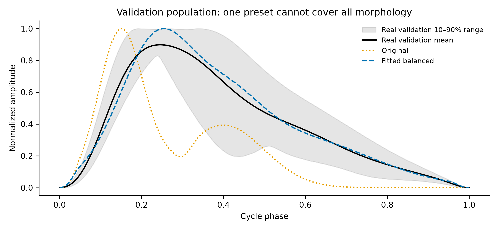
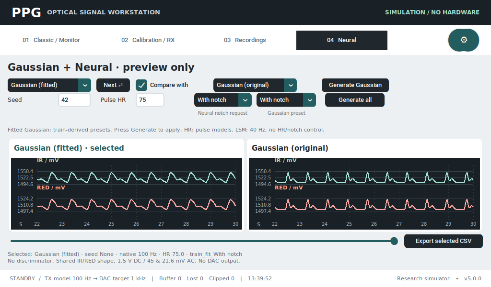
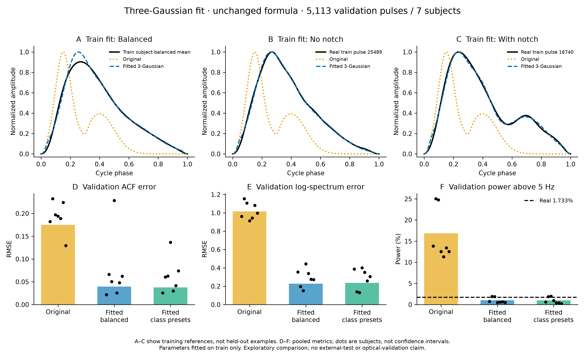

# Tinh chỉnh ba Gaussian theo PPG thật

> Bản ghi lần fit ban đầu. Trang 04 hiện chỉ giữ Gaussian fitted cạnh mẫu real,
> với hai profile có/không có notch nhìn thấy. Xem [báo cáo lựa chọn hình thái](ppg_morphology_selection_2026-09-28.md)
> để biết đánh đổi với neural và cách dùng giao diện mới. Classic vẫn giữ Gaussian nguyên bản.

Đã fit các tham số của **chính công thức ba Gaussian hiện có**, không thay
bằng neural hoặc replay waveform. App có **Gaussian (fitted)** cạnh
**Gaussian (original)**. Bản mới đang ở chế độ xem thử theo phạm vi đã chốt;
Classic và đầu ra DAC/LED chưa được chuyển sang preset mới.

## Kết quả thực tế

Fit trên **25.684 xung / 32 bệnh nhân train**, mỗi bệnh nhân có trọng số bằng
nhau khi tạo template tổng hợp. Kiểm tra trên toàn bộ **5.113 xung / 7 bệnh
nhân validation**, không trùng bệnh nhân train. Không đọc test trong lần fit này.

| Chỉ số | Gaussian gốc | Fitted Balanced | Thay đổi |
|---|---:|---:|---:|
| RMSE dạng sóng chuẩn hóa | 0,33236 | 0,15563 | Giảm **53,17%** |
| RMSE tự tương quan | 0,17518 | 0,03937 | Giảm **77,53%** |
| RMSE phổ log | 1,01569 | 0,22819 | Giảm **77,53%** |
| Công suất >5 Hz | 16,8503% | 1,0298% | Real là **1,7334%** |

Ba tiêu chí phổ, tự tương quan và mức năng lượng cao tần đều gần real hơn
so với preset gốc trên phép đo này. Tuy nhiên năng lượng cao tần vẫn thiếu
khoảng 40,6% so với real; không thể gọi là tái tạo hoàn hảo. Đây không phải
“độ chính xác 53%”: 53,17% là mức giảm RMSE so với preset cũ.

Sai số dạng sóng giảm ở **6/7 bệnh nhân**; riêng s09483 tăng 5,81%. Một preset
cố định không tối ưu cho mọi người, HR hoặc hình thái. Không dùng loss hoặc
điểm D để chọn kết luận này. Không so trực tiếp bảng trên với bảng 256 xung
cân bằng lớp của vòng 2 hoặc metric đoạn dài của LSM.



Đường đen là trung bình validation; vùng xám là phân vị 10–90% từng pha,
không phải khoảng tin cậy. Mỗi xung gốc đã chuẩn hóa đỉnh về 1, nhưng đường
trung bình có đỉnh thấp hơn 1 vì pha đỉnh khác nhau giữa các xung.

## Thay đổi về hình dạng và công thức

Preset gốc dùng đỉnh systolic sớm/hẹp, vai diastolic nhỏ và đuôi ngắn. Bản
fit dịch đỉnh muộn hơn, mở rộng vùng đỉnh và giữ phần giảm chậm đến cuối
chu kỳ. Ba thành phần vẫn gồm hai Gaussian dương và một Gaussian làm suy
giảm cục bộ:

`pulse = normalize(taper * (G_sys + a_dia*G_dia) * (1 - depth*G_notch))`

Taper ở 5% đầu/cuối chu kỳ và chuẩn hóa đỉnh liên tục được giữ nguyên.
`models/waveform.py` khớp byte với bản sao trước lượt này. Bộ tham số mới
nằm trong [profiles.json](../assets/gaussian/profiles.json), dùng cùng
`PulseMorphology` và `PulseShaper`, không cần torch/scipy trong app.

| Tham số theo pha chu kỳ | Original | Balanced |
|---|---:|---:|
| Tâm Gaussian systolic | 0,150000 | 0,305853 |
| Tâm Gaussian suy giảm | 0,300000 | 0,352758 |
| Tâm Gaussian diastolic | 0,400000 | 0,560761 |
| Độ rộng systolic | 0,055000 | 0,111664 |
| Độ rộng suy giảm | 0,020000 | 0,127418 |
| Độ rộng diastolic | 0,100000 | 0,190883 |
| Biên độ thành phần diastolic | 0,400000 | 0,180737 |
| Mức suy giảm cục bộ | 0,250000 | 0,559963 |

Các tâm thành phần **không phải vị trí cực trị SP/DN/DP đo được trên tổng
sóng**. Mức suy giảm 0,56 cũng không có nghĩa DN/SP bằng 0,56. Đây là tham
số toán học fit từ dataset, không phải khoảng sinh lý chuẩn.

## Ba preset và cách dùng

Vào **04 Neural**, mặc định chọn **Gaussian (fitted)** và so với bản gốc.
Menu **Gaussian preset** có:

- **Balanced:** fit trung bình có trọng số bằng nhau theo bệnh nhân train;
  không dùng nhãn notch để xây template. Đây là preset khởi đầu.
- **No notch:** fit xung train 25489, gần template nhóm và không thấy notch
  theo detector độc lập.
- **With notch:** fit xung train 16740, gần template nhóm và có rebound rõ;
  thêm ràng buộc giữ điểm lõm/đỉnh sau lõm khi fit. Preset cuối được kiểm tra
  có một local minimum và rebound thật, không chỉ đổi nhãn giao diện.

Đổi HR và preset rồi nhấn **Generate Gaussian**. Không cần nạp model neural.
**Compare with → Gaussian (original)** để đối chiếu, hoặc chọn cWGAN/LSM/TCN
sau **Generate all**. Menu **Neural notch request** chỉ điều khiển cWGAN/TCN,
độc lập với menu Gaussian preset. Seed không tác động tới Gaussian cố định.



**Export selected CSV** vẫn tạo 30 giây/100 Hz với metadata variant và hash.
IR/RED chung shape, AC/DC danh định; không phải cặp quang học được đo thật.
[CSV Balanced](../ml/runs/gaussian-preview/Balanced.csv) ·
[CSV có notch](../ml/runs/gaussian-preview/With_notch.csv) ·
[Bộ preset để mang sang Pi](../ml/runs/gaussian-preview/gaussian-profiles.tar.gz).
Chép mã app mới cùng `assets/gaussian/profiles.json`; giữ model neural cũ.
Không cần huấn luyện lại hoặc tải lại năm TorchScript.

## Phương pháp và giới hạn

Tối ưu bounded least squares, 24 điểm khởi tạo cố định, fit tám tham số,
giữ systolic amplitude bằng 1 vì sẽ chuẩn hóa đỉnh. Chỉ train tham gia
objective và chọn điểm khởi tạo tốt nhất. Đây là nghiệm số tốt nhất tìm
được trong các lần khởi tạo/giới hạn đã đặt, không có chứng minh tối ưu toàn cục.

Ban đầu có thử trung bình theo lớp, nhưng notch bị làm mờ vì khác pha giữa
các nhịp. Lần kế tiếp dùng xung đại diện; bản cuối thêm ràng buộc bảo toàn
rebound/cực trị từ xung train. Các bản thử giữ trong `gaussian-fit-v1/v2/v3`;
bản đóng băng dùng trong app là `gaussian-fit-final`. Trong quá trình phát
triển đã xem số đo validation, nên đây là **so sánh thăm dò**, không được
mô tả validation là tập kiểm định chưa từng xem. Test cũ cũng đã được xem
ở các vòng trước. Chưa có cohort ngoài hoặc phép đo trên Pi thật.

Hai preset theo lớp vẫn xuất phát từ nhãn tự động cũ cộng kiểm tra hình thái
bằng thuật toán độc lập, chưa có nhãn chuyên gia. Bản có notch phục vụ tạo
mẫu có notch; không phải mọi PPG thực đều cần có notch nhìn rõ.



A–C là **tham chiếu train dùng để fit**, không phải ví dụ validation.
D–F là metric validation; chấm đen là từng bệnh nhân, không phải CI.
[Bảng CSV](gaussian-fit/comparison.csv) · [Hình PDF](gaussian-fit/comparison.pdf) ·
[Metric theo bệnh nhân](gaussian-fit/metrics.json) · [Kiểm tra xuất file](gaussian-fit/verification.json).

## Kiểm thử

- **713 passed, 1 skipped, 288 subtests passed**; 5 cảnh báo deprecation
  TorchScript từ các test neural cũ, không có test fail.
- Kiểm tra preset fit gần tham chiếu train hơn bản gốc, có/không notch thật,
  hữu hạn, nằm trong [0,1], biên chu kỳ liên tục và không cần torch.
- Thiếu file preset không làm hỏng Gaussian gốc/Classic; lỗi khi yêu cầu
  preset fitted được hiển thị, không âm thầm thay bằng xung khác.
- UI 1280×800 và 1024×600 với suy luận thật, chọn năm chế độ, chuyển preset,
  so sánh và xuất dữ liệu đã chạy trong dry-run. Engine đang chạy không bị
  các thao tác preview thay đổi.
- Bốn CSV Original/Balanced/No notch/With notch có 3.000 dòng, timestamp
  đúng 0,01 s, điện áp hữu hạn/đúng giới hạn, AC_RED/AC_IR = 0,48.

```bash
.venv/bin/python -m ml.fit_gaussian --output ml/runs/gaussian-fit-reproduce
.venv-ml/bin/python -m ml.gaussian_figures --run ml/runs/gaussian-fit-reproduce
.venv/bin/python -m pytest -q
```

Thư mục output fit phải mới. Script không tự cài preset vào app hoặc điều
khiển DAC. Dataset SHA-256 và source hash được lưu trong manifest để truy vết.
