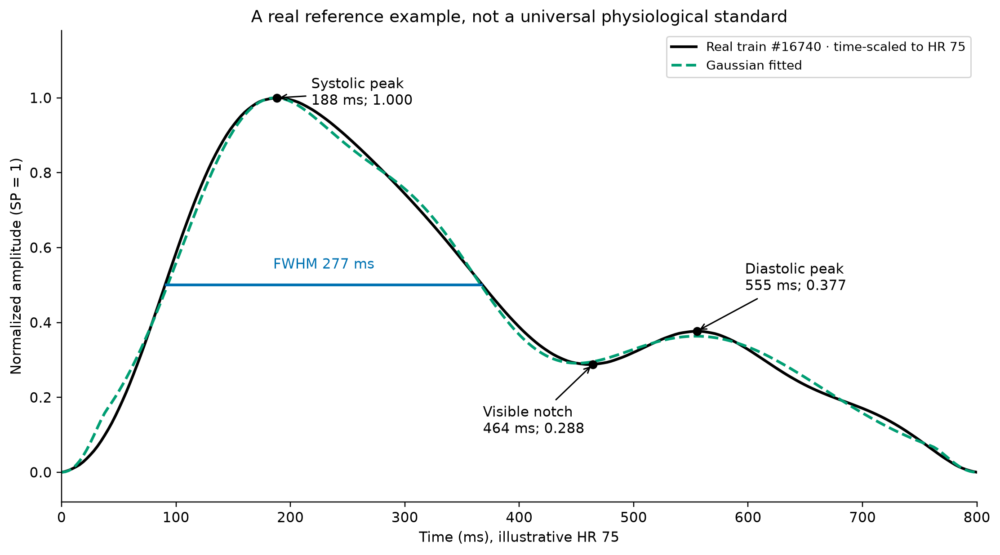
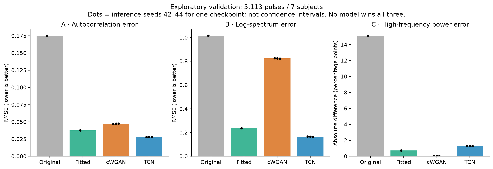
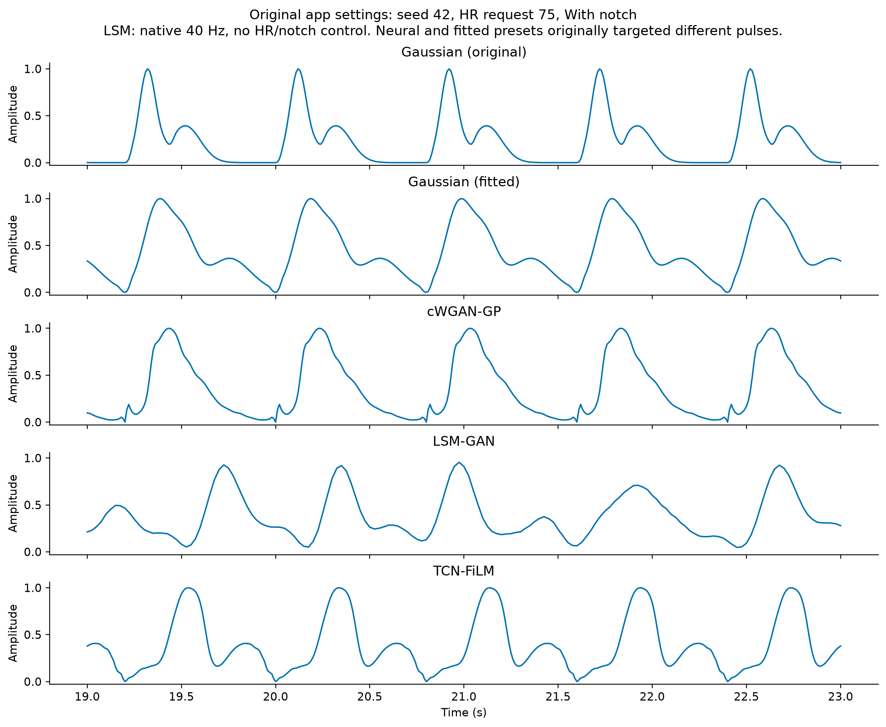
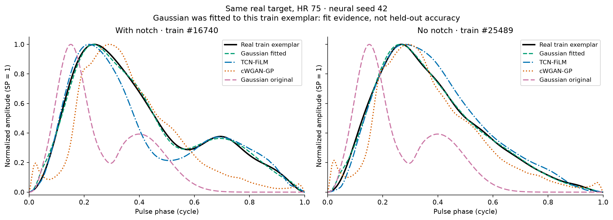
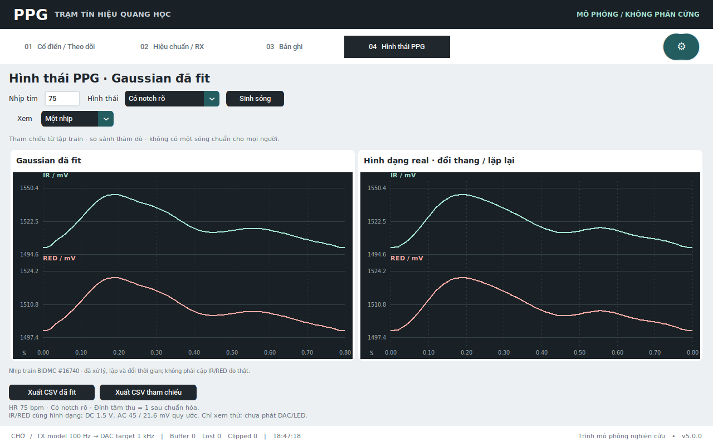

# Chọn dạng sóng PPG cho app: nghiên cứu và số đo thực

Đo và tra cứu ngày 28/09/2026; hoàn tất tài liệu ngày 29/09/2026.
**Không có một dạng PPG duy nhất được chứng minh là “chuẩn nhất”
cho mọi người.** Với mục tiêu tái tạo một mẫu real rõ ràng để xem trong app, giữ
**Gaussian fitted** và đặt mẫu real đã dùng để fit ở bên cạnh. Với mục tiêu sinh
hình thái theo điều kiện trên validation, **TCN-FiLM tốt hơn về ACF và phổ**, nhưng
sai lệch năng lượng cao tần lớn hơn. Không có mô hình thắng cả ba tiêu chí.

Đây là **so sánh thăm dò**: validation và test đã được xem trong phát triển trước.
Không dùng loss hoặc điểm D để chọn. Không huấn luyện lại hay chọn lại checkpoint.
Quyết định thu gọn UI là quyết định kỹ thuật cho **mẫu cố định**, không phải xếp hạng
tổng quát hay kết luận Gaussian thắng nghiên cứu sinh dữ liệu. Hai mẫu train được
fit trực tiếp nên sai số fit nhỏ không được gọi là độ chính xác trên dữ liệu mới.

## “Chuẩn” nên hiểu thế nào?

Một ví dụ PPG rõ để minh họa thường có sườn lên nhanh, đỉnh tâm thu nổi trội, sườn
xuống chậm hơn, có thể có notch và một đỉnh phụ nhỏ hơn, rồi về chân nhịp kế tiếp.
WF-PPG gọi dạng hai đỉnh với đỉnh trái lớn hơn là Type 2L trong bối cảnh tối ưu lực
ép cảm biến. Tuổi, vị trí đo và lực ép làm hình thái thay đổi; thiếu notch nhìn
thấy không tự nó chứng minh sóng không thật. [WF-PPG](https://www.nature.com/articles/s41597-025-04453-7),
[Allen & Murray](https://pureportal.coventry.ac.uk/en/publications/age-related-changes-in-the-characteristics-of-the-photoplethysmog/).

Độ cao tuyệt đối tính bằng mV phụ thuộc hệ đo. Trong audit này chân nhịp được đặt
bằng 0 và đỉnh bằng 1 để so hình dạng. Trong app, DC 1,5 V, AC IR 45 mV và RED
21,6 mV là quy ước mô phỏng; không phải các mức “bình thường” đo từ người.
Notch được mô tả bằng **độ cao đáy notch/SP** và **độ tăng từ notch lên đỉnh phụ**;
không nhầm toàn bộ đoạn giảm từ SP xuống notch với độ sâu rãnh notch cục bộ.

Không dùng thời điểm SP trên PPG ngoại vi làm thời điểm kết thúc tống máu trực tiếp.
Mốc cực tiểu nhìn thấy và mốc sinh lý suy ra qua đạo hàm/thuật toán không luôn giống
nhau. [pyPPG](https://doi.org/10.1088/1361-6579/ad33a2),
[Pal et al.](https://doi.org/10.1016/j.cmpb.2024.108283).

Đã lập [bảng 12 nguồn cốt lõi và giới hạn truy cập](morphology-audit/research-evidence.md),
gồm nghiên cứu journal, EMBC/I2MTC, dữ liệu gốc và mã tác giả. Đây là tra cứu có mục
tiêu, không tuyên bố đã đọc tất cả nghiên cứu hoặc mọi diễn đàn.

## Đỉnh, notch và đuôi đo được

Mốc real là BIDMC đã xử lý: lowpass 12 Hz zero-phase, trừ baseline nối hai chân,
PCHIP về 256 điểm và chuẩn hóa. Dữ liệu gốc thuộc nhóm bệnh nhân nặng; các con số
bên dưới không phải khoảng tham chiếu người khỏe. [Nguồn BIDMC](https://physionet.org/content/bidmc/1.0.0/).

Toàn bộ validation: **5.113 nhịp, 7 người**, không giao người với train. P10–P90
là phân vị theo nhịp, không phải khoảng tin cậy; số nhịp mỗi người không bằng nhau.

| Đặc điểm real đã xử lý | Trung vị | P10–P90 |
|---|---:|---:|
| Vị trí SP tính từ chân nhịp | 25,88% chu kỳ | 19,22–34,90% |
| Thời gian tới SP ở HR gốc của từng nhịp | 151,2 ms | 127,6–200,5 ms |
| Bề rộng ở nửa độ cao SP (FWHM) | 34,33% chu kỳ | 21,31–49,04% |
| FWHM ở HR gốc từng nhịp | 232,5 ms | 142,0–287,6 ms |
| Biên độ đuôi tại 80% chu kỳ / SP | 0,130 | 0,055–0,238 |
| Biên độ đuôi tại 90% chu kỳ / SP | 0,069 | 0,036–0,109 |
| Độ cao đáy notch / SP, chỉ nhịp detector thấy notch | 0,165 | 0,039–0,253 |
| Độ tăng notch → đỉnh phụ / SP, cùng nhóm | 0,187 | 0,045–0,239 |

Detector độc lập thấy rãnh + rebound >=3% ở **934/5.113 nhịp (18,27%)**. Đây là
quy tắc tính toán của repo, không tỷ lệ sinh lý đã được chuyên gia gán nhãn. Nhãn
notch dùng để train được tạo bằng thuật toán khác; không đồng nhất hai tỷ lệ này.
Chuẩn hóa/baseline có ảnh hưởng lên các tỷ số độ cao; việc đuôi cuối nhịp về 0 một
phần là do tiền xử lý, không phải phát hiện mới về sinh lý.

Ví dụ real train **#16740**, giữ cùng hình dạng rồi đổi thời gian sang HR 75
(chu kỳ 800 ms), là mốc mặc định có notch trong trang mới:

| Đặc điểm | Real tham chiếu | Gaussian fitted | Gaussian original |
|---|---:|---:|---:|
| Đỉnh SP | 188 ms; cao 1 | 185 ms; cao 1 | 122 ms; cao 1 |
| Khoảng vùng cao hơn nửa đỉnh | 90–368 ms | 93–367 ms | 69–177 ms |
| Bề rộng nửa đỉnh | 277 ms | 274 ms | 109 ms |
| Notch: vị trí; độ cao/SP | 464 ms; 0,288 | 452 ms; 0,291 | 238 ms; 0,195 |
| Đỉnh phụ: vị trí; độ cao/SP | 555 ms; 0,377 | 555 ms; 0,363 | 320 ms; 0,393 |
| Rebound notch → đỉnh phụ / SP | 0,089 | 0,072 | 0,198 |
| Đuôi ở 80% / 90% chu kỳ | 0,249 / 0,143 | 0,272 / 0,124 | 0,000132 / 0,00000147 |

Ví dụ này có một rãnh khá nhẹ: đỉnh phụ chỉ cao hơn đáy notch khoảng **8,9% SP**.
Không cần khoét notch thật sâu để làm sóng trông “đúng”. Gaussian original đạt
đỉnh quá sớm, hẹp, đỉnh phụ quá sớm và đuôi tắt sớm so với **mẫu này**. Những đặc
điểm đó không được nâng thành tiêu chí loại mọi nhịp khác trong dân số.



## So sánh các lựa chọn trong ảnh 4

Đo trên cùng 5.113 nhịp validation, cùng điều kiện cho hai neural pulse models;
seed suy luận 42/43/44, một checkpoint mỗi kiến trúc. Các mạng được cung cấp điều
kiện hình thái tự động trích từ nhịp real tương ứng; Gaussian class preset chỉ
chọn hai mẫu theo cờ notch, còn original không điều kiện. Đây là lợi thế thông tin
của neural trong bài toán **conditional synthesis**, không phải dự đoán hình dạng
từ HR đơn độc. Ba seed suy luận không phải ba lần huấn luyện độc lập.

| Mô hình | ACF RMSE ↓ | log-PSD RMSE ↓ | Năng lượng >5 Hz (%) | Sai số HF tuyệt đối (điểm %) ↓ | RMSE hình dạng, bổ sung ↓ |
|---|---:|---:|---:|---:|---:|
| Gaussian original | 0,17518 | 1,01569 | 16,8503 | 15,1169 | 0,33236 |
| Gaussian fitted, chọn preset theo cờ notch | 0,03765 | 0,23676 | 0,9959 | 0,7375 | 0,15354 |
| cWGAN-GP, trung bình 3 seed | 0,04729 | 0,82468 | 1,7167 | **0,0167** | 0,18427 |
| TCN-FiLM, trung bình 3 seed | **0,02799** | **0,16580** | 0,4384 | 1,2950 | **0,11202** |
| Real | — | — | 1,7334 | — | — |

HF = tỷ phần công suất trên 5 Hz, tính từ phổ xung có cửa sổ Hann và đổi harmonic
theo HR; không phải dải HF của HRV. Sai số HF của neural là trung bình sai số tuyệt
đối mỗi seed. ACF so trung bình các ACF 128 lag; log-PSD so trung bình log10 phổ
chuẩn hóa, floor 1e-8. Không dùng scalar `development_score` cũ để xếp hạng.
Metric theo từng người có trong JSON; chưa có CI theo người hoặc cohort độc lập.

TCN giữ notch yêu cầu tốt hơn cWGAN trong audit tự động, nhưng năng lượng cao tần
thấp hơn real khoảng 75%. cWGAN đạt HF trung bình gần real không đồng nghĩa đúng
hình dạng: trong mẫu seed 42 nó tạo gợn gần chân nhịp và không tái tạo notch yêu
cầu. Khớp một tổng công suất có thể che khác biệt vị trí và cấu trúc phổ.



LSM-GAN **sinh đoạn 30 giây/40 Hz**, không điều khiển HR/notch; không nhét vào bảng
256 điểm một nhịp trên. Kết quả v2 đã lưu: ACF MMD² 0,10571; log-PSD MMD² 1,49764;
RMSE log-PSD 1,73491; HF 0,01978%, real strip 0,00209%. Đây là bảng test đã được
xem trước, **thăm dò**, không lần test mới. Adapter cWGAN ở audit đoạn cũ có lọc
0,9–5 Hz, raw LSM không có; không xếp hạng chúng như điều kiện ngang bằng. Không
kết luận LSM “bệnh lý/không thật” chỉ vì nhịp không đều trong ảnh. Xem
[báo cáo xác minh v2](ppg_neural_preview_report_2026-09-28.md).



Ảnh cũ chưa so cùng template: preset neural With notch yêu cầu SP tại **45,88%**
chu kỳ, còn template Gaussian fitted có SP ở **23,53%**. TCN trong ảnh có SP khoảng
41,96%, nên nhìn muộn/hẹp không chỉ là lỗi kiến trúc. Khi cho TCN điều kiện của
cùng real #16740, SP chuyển về 21,96%. Hình dưới sửa yếu tố gây nhiễu này; vẫn
không phải đánh giá ngoài mẫu vì Gaussian đã fit chính template đó.



| Fit với real train #16740 có notch, HR75 | ACF RMSE | log-PSD RMSE | HF (%) / real 0,17029% | RMSE hình dạng |
|---|---:|---:|---:|---:|
| Gaussian fitted | 0,00704 | 0,21355 | 0,43118 | 0,01753 |
| TCN-FiLM seed42, cùng target | 0,13338 | 0,47582 | 0,14477 | 0,10065 |
| cWGAN seed42, cùng target | 0,11780 | 1,02466 | 0,24059 | 0,16259 |

Ngay trên template này, TCN vẫn gần HF hơn fitted; không bỏ cột bất lợi. Ở template
không notch, fitted RMSE hình dạng 0,01362 so với TCN 0,05297, nhưng TCN gần log-PSD
hơn. Tất cả số còn lại có trong [matched-targets.json](morphology-audit/matched-targets.json).

## Thay đổi app và lý do giữ/bỏ

| Lựa chọn cũ | Xử lý trong trang 04 | Lý do |
|---|---|---|
| Gaussian original | Bỏ khỏi menu so sánh; mode nguyên bản ở Classic vẫn giữ theo yêu cầu trước | Preset cũ hẹp và cụt đuôi so với mục tiêu; giữ Classic để tương thích nguồn phát đã có, không gọi là real chuẩn |
| Gaussian fitted | **Generator duy nhất của trang 04**, có và không có notch | Phù hợp nhiệm vụ tái tạo hai mẫu real cố định, sai số fit nhỏ, nhẹ, không cần torch; không thắng mọi metric hoặc bao phủ dân số |
| cWGAN-GP | Bỏ khỏi menu, lưu backend/checkpoint để tái kiểm tra | Hình thái/notch và log-PSD còn yếu dù HF trung bình gần real |
| LSM-GAN | Bỏ khỏi menu, lưu backend/checkpoint | Không điều khiển một nhịp mẫu, khác bài toán; không gán nhãn mọi output là giả |
| TCN-FiLM | Bỏ khỏi menu đơn giản hóa, **giữ nguyên ứng viên nghiên cứu** | Tốt nhất ACF/phổ validation nhưng chưa thay thế tốt bằng fit cho template cụ thể; không bị loại vì “kiến trúc sai” |

Không chỉnh trọng số hoặc xây thang điểm mới để tuyên bố một người thắng. Nếu mục
tiêu chuyển sang sinh dữ liệu đa dạng theo người, TCN phải được đánh giá tiếp;
không nên dùng hai Gaussian template lặp để đại diện toàn bộ biến thiên sinh lý.
Một waveform mẫu tốt không thay thế kiểm tra HRV, nhịp thở hoặc artefact thực.

Trang **04 Hình thái PPG / PPG morphology** hiển thị fitted cạnh **hình dạng real
đã đổi thang/lặp lại**; mặc định xem một nhịp, có thể chuyển 8 giây. Hai trace có
cùng HR yêu cầu, mức DC/AC và trục thời gian. Không phải dữ liệu IR/RED đồng thời
đo thật. Có hai nút xuất CSV + JSON riêng, tham chiếu ghi index train và hash dataset.
Toàn bộ trang mới đổi được Việt/Anh qua Settings. Giữ chế độ xem thử, chưa nối DAC/LED.



Mã giao diện cũ lưu ở `docs/archive/preview-five-modes/`; backend `NeuralPreview`
và model bundles vẫn còn để tái lập thí nghiệm. Không xóa dữ liệu nghiên cứu.
Không triển khai lên Pi từ xa, không xác nhận phát quang thực. App đang mở cần mở
lại để nạp giao diện mới; không tự đóng tiến trình điều khiển của người dùng.

## Tái lập và kiểm thử

```bash
rtk proxy .venv/bin/python -m ml.morphology_audit --output /tmp/ppg-morphology-audit-new
rtk proxy .venv-ml/bin/python -m ml.morphology_figures
rtk proxy .venv/bin/python -m pytest -q
rtk proxy .venv/bin/python scripts/smoke_neural_ui.py
```

Audit từ chối ghi đè thư mục kết quả. Figure script đọc bộ kết quả đã đóng băng ở
`docs/morphology-audit/`. Model/dataset hashes có trong [metrics.json](morphology-audit/metrics.json);
[CSV metric](morphology-audit/comparison.csv), [CSV fitted](morphology-audit/fitted.csv),
[CSV real quy đổi](morphology-audit/real-reference.csv), hình PNG/PDF cùng thư mục.

Full suite: **724 passed, 1 skipped, 288 subtests passed**. Smoke GUI Xvfb đã kiểm
tra kích thước cửa sổ thực 1280×800 và 1024×600, cả hai ngôn ngữ, một nhịp/8 giây,
hai profile, HR không hợp lệ, xuất provenance qua unit test. Không nạp torch trên
trang mới; tham số signal engine không thay đổi. Thử khi engine đang chạy dùng
DRY_RUN, không phải bằng chứng phần cứng. Backend neural lưu trữ vẫn qua kiểm tra
repeatability và BatchNorm eval không đổi buffer. Có cảnh báo TorchScript deprecated.
