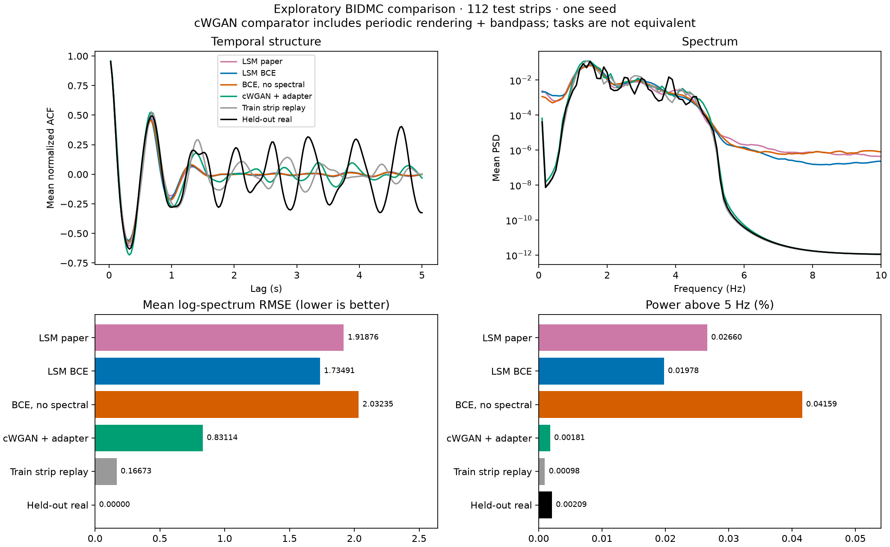
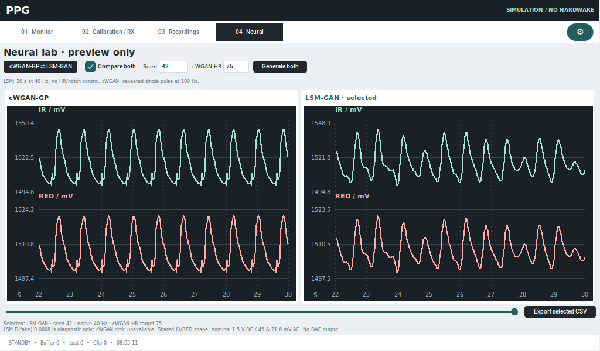

# cWGAN-GP / LSM-GAN v2: xác minh và tích hợp xem thử trong app

> Bản ghi lịch sử xác minh hai mô hình ngày 28/09/2026; trạng thái Kaggle bên dưới
> là tại lần kiểm tra đó. Giao diện hiện đã thu gọn thành Gaussian fitted cạnh
> mẫu real; xem [báo cáo hình thái và giao diện hiện tại](ppg_morphology_selection_2026-09-28.md).
> Backend/checkpoint và các số liệu LSM v2 bên dưới được giữ nguyên để tái lập.

Ngày xác minh: **28/09/2026**. Đã hoàn thành kiểm tra Kaggle, tải lại artifact,
đối chiếu checkpoint, kiểm tra IR/RED và tích hợp hai generator vào trang
**04 Neural** của ứng dụng. Theo lựa chọn của người dùng, chức năng này chỉ
xem thử trên màn hình, **không phát DAC/LED**. Chưa chạy hoặc đo trên Pi thật.

## Kết quả thực nghiệm

[Kaggle LSM comparison](https://www.kaggle.com/code/charlesday2612/ppg-lsm-gan-bidmc-comparison)
hiện báo **COMPLETE**. Output chứa revision
`v2: consistent D train-mode during G update`; source kéo từ Kaggle khớp SHA-256
`a0ff8319a281285768b34a290065ee1dc3ac112dcda7b8d54a40d013c6ddf47b`.
Lệnh pull dùng hậu tố `/2` trả 403; pull slug hiện tại thành công. Vì vậy
việc xác nhận v2 dựa trên revision và hash source/output, không chỉ tên thư mục.
**26 file nguồn dữ liệu/checkpoint/model/metric/history tải lại khớp hoàn toàn
với bộ v2 đã có tại local.** Không chạy lại training hoặc chọn lại checkpoint.

Cả ba nhánh LSM chạy 1.500 bước trên Tesla T4, seed 42; checkpoint được chọn
bằng validation ACF MMD² + log-PSD MMD². Dữ liệu: 624 train / 112 validation /
112 test, giữ cách chia bệnh nhân. Bảng dưới được tính lại từ các mẫu đã lưu.
Ba cột sai số càng thấp càng tốt; công suất trên 5 Hz cần đối chiếu dữ liệu thật.

| Mô hình | Bước chọn | ACF MMD² | log-PSD MMD² | RMSE phổ log | Công suất >5 Hz (%) |
|---|---:|---:|---:|---:|---:|
| LSM objective bài báo | 1.000 | 0,10431 | 1,52702 | 1,91876 | 0,02660 |
| LSM BCE, code đã sửa | 800 | 0,10571 | 1,49764 | 1,73491 | 0,01978 |
| BCE cùng G/D, bỏ spectral loss | 1.400 | 0,10521 | 1,52457 | 2,03235 | 0,04159 |
| cWGAN v1 + adapter xung tuần hoàn | — | 0,06104 | 0,51492 | 0,83114 | 0,00181 |
| Replay xung train + adapter | — | 0,05607 | 0,63970 | 1,02756 | 0,00140 |
| Replay đoạn train 30 s | — | 0,07473 | 0,04378 | 0,16673 | 0,00098 |
| Test thật, tự đối chiếu | — | 0 | 0 | 0 | 0,00209 |

Trong cặp BCE cùng kiến trúc, spectral loss giảm RMSE phổ log **14,6%**,
log-PSD MMD² **1,77%**, công suất trên 5 Hz khoảng **52,4%**; ACF MMD² tăng
khoảng **0,47%**, tức không cải thiện. Nền phổ ngoài dải của LSM BCE vẫn cao
hơn test thật khoảng 9,5 lần. Không dùng loss train hoặc điểm D để kết luận
mô hình tốt hơn, và không quy các metric này thành “độ chính xác PPG”.



[Bảng CSV](neural-comparison/comparison_table.csv) ·
[Hình PDF](neural-comparison/comparison_summary.pdf) ·
[Bằng chứng kiểm tra](neural-comparison/verification.json).

Đây là **so sánh thăm dò**: test đã được xem ở pilot trước, một seed, chưa có
cohort độc lập hoặc khoảng tin cậy theo bệnh nhân. **cWGAN sinh một nhịp,
LSM sinh đoạn dài**; adapter cWGAN đã áp đặt tuần hoàn và lọc 0,9–5 Hz,
trong khi raw LSM phải tự học cấu trúc đoạn. Không xem bảng này là phép xếp
hạng hoàn toàn ngang bằng. Kết quả notch cWGAN cũ vẫn chỉ 2/103; chưa có
đánh giá SP/DN/DP riêng cho LSM. Không chọn mô hình dùng lâm sàng từ bảng này.

## Kiểm tra G/D, BatchNorm và IR/RED

- Sáu TorchScript của ba nhánh LSM khớp mạng dựng từ `best.pt` ở batch 3,
  `atol=1e-6`, `rtol=1e-5`; đầu ra hữu hạn, G `(3,1,1200)`, D `(3,2)`.
- Ba `last_training_state.pt` đều ở bước 1.500, chứa G/D và trạng thái hai
  optimizer; các tensor đã kiểm tra đều hữu hạn.
- cWGAN generator TorchScript khớp `generator_best.pt`. **Pilot cWGAN không
  lưu critic**: không thể khôi phục D từ G, và giao diện ghi rõ D không có.
- Test hồi quy xác nhận khi cập nhật G: D ở `train()`, khóa gradient của D,
  BatchNorm vẫn cập nhật batch counter, gradient đi qua D tới G. Khi suy luận,
  cả G/D ở `eval()` và `inference_mode()`; test mẫu thật xác nhận buffer
  BatchNorm không thay đổi qua nhiều lần sinh mẫu.
- Probe cùng 32 mẫu của LSM BCE: eval D(real/fake) **0,85576 / 0,00398**,
  train **0,49289 / 0,00233**. Hai chế độ vẫn khác nhau; sửa vòng train không
  đồng nghĩa running statistics hoàn hảo. Điểm D chỉ có ý nghĩa chẩn đoán.
- Kiểm tra lại năm CSV gốc: ba file LSM 1.200 dòng/40 Hz/30 s, cWGAN
  400 dòng/100 Hz/4 s và 4.000 dòng/1000 Hz/4 s. Timestamp đúng bước,
  không NaN/Inf, điện áp trong 0–3,28 V, AC_RED/AC_IR = **0,48**.
- IR/RED cùng một shape, đổi theo `IR=1,5+0,045*x` và
  `RED=1,5+0,0216*x`. SpO₂ 98 là ví dụ hiệu chuẩn A=110, B=25, không phải
  SpO₂ đã học hoặc đo quang học.

Audit đầy đủ: [G/D và probe BN](../ml/runs/lsm-v2-verification/download/lsm_comparison/audit.json).
Audit thí nghiệm dùng môi trường ML Python 3.14/PyTorch 2.14 CPU có cảnh báo
TorchScript trên Python 3.14. **App thực tế đã chạy và kiểm thử riêng bằng
Python 3.12.3 / PyTorch 2.10.0 CPU**; không dựa vào runtime 3.14 để chạy GUI.
TorchScript vẫn có cảnh báo deprecated; chưa chuyển định dạng model trong lượt này.

## Dùng trong app Pi

1. Mở **04 Neural**, nhấn **Generate both**. Hai model chạy CPU trong worker;
   giao diện tiếp tục phản hồi trong lúc nạp model/sinh mẫu.
2. **Compare both** hiển thị hai mẫu cạnh nhau. Nút **cWGAN-GP ⇄ LSM-GAN**
   đổi mẫu đang chọn; bỏ Compare both để xem riêng mẫu được chọn.
3. Kéo thanh thời gian để xem từng cửa sổ 8 giây trong đoạn 30 giây.
4. Đổi **Seed** để sinh cặp mẫu khác. **cWGAN HR** chỉ áp dụng cho cWGAN;
   LSM không có điều khiển HR/notch. Các điều kiện hình thái cWGAN còn lại
   lấy từ một xung train gần 75 bpm, có lưu chính xác trong manifest/metadata.
5. **Export selected CSV** lưu timestamp native và điện áp, kèm JSON chứa
   model hash, variant, seed, condition, Fs và hiệu chuẩn. cWGAN xuất
   3.000 dòng/100 Hz; LSM 1.200 dòng/40 Hz, đều có thời lượng 30 giây.



Trong app, cWGAN là **preview không lọc** của xung lặp, còn bảng nghiên cứu
ở trên dùng adapter có bandpass như giao thức đã chốt. Preview seed mới
không được đưa vào bảng benchmark. Không nối/lặp các đoạn LSM thành tín
hiệu DAC. Chức năng Neural không thay đổi tham số nguồn phát hiện tại.

Model bundle khoảng 4,5 MB (trước nén): hai G và một D LSM; app không cần
dataset huấn luyện, SciPy, NeuroKit hoặc checkpoint optimizer để xem thử.
Thư viện ML chỉ được nạp khi nhấn Generate; app cơ bản vẫn mở được nếu
chưa cài PyTorch. Thiếu model/dependency hoặc sai checksum sẽ hiện lỗi,
không âm thầm thay bằng tín hiệu giả lập khác.

### Chuẩn bị trên Pi

Dùng Python 3.11/3.12 trong môi trường ứng dụng và hệ điều hành aarch64.
Từ thư mục repo, cài dependency tùy chọn và giải nén bundle đã cung cấp:

```bash
.venv/bin/python -m pip install -r requirements/neural.txt
tar -xzf /path/to/neural-models.tar.gz
.venv/bin/python main.py
```

Chọn wheel PyTorch phù hợp aarch64 của Pi; không chép `.venv` x86_64 từ máy này.
Nếu đang có model trong `ml/runs`, có thể tạo lại bundle:

```bash
.venv/bin/python scripts/prepare_neural_preview.py
```

[Bundle model](../ml/runs/neural-preview/neural-models.tar.gz) ·
[cWGAN preview CSV](../ml/runs/neural-preview/cWGAN-GP.csv) ·
[LSM preview CSV](../ml/runs/neural-preview/LSM-GAN.csv).
Các model lớn nằm ngoài Git theo `.gitignore`; cần mang bundle cùng mã nguồn
khi chép repo sang Pi. Không có kết nối hoặc chạy thử trên Pi thật trong lượt này.

## Kiểm thử và tái kiểm tra

- Full suite môi trường app: **696 passed, 1 skipped, 288 subtests passed**.
- Suite ML cWGAN + LSM riêng: **31 passed** (cũng được bao gồm khi dependency có đủ).
- 10 test mới kiểm tra lazy import, checksum, model thiếu, đầu vào không hợp lệ,
  seed lặp lại, BN bất biến ở eval, timing/điện áp/CSV và metadata.
- Smoke UI với model thật trên Xvfb **1280×800** và **1024×600**: sinh nền,
  chuyển mô hình, xem riêng/song song, thanh thời gian, lỗi nhập liệu đều đạt;
  tham số engine không đổi và DAC mô phỏng vẫn bằng 0.
- Đã xem ảnh chụp UI và hình kết quả; `git diff --check` sạch.

```bash
uv tool run --from kaggle kaggle kernels status charlesday2612/ppg-lsm-gan-bidmc-comparison
uv tool run --from kaggle kaggle kernels output charlesday2612/ppg-lsm-gan-bidmc-comparison -p ml/runs/lsm-v2-verification/download -q
uv tool run --from kaggle kaggle kernels logs charlesday2612/ppg-lsm-gan-bidmc-comparison
.venv-ml/bin/python -m ml.audit_lsm_run ml/runs/lsm-v2-verification/download/lsm_comparison
.venv-ml/bin/python -m ml.verify_lsm_artifacts
PPG_DRY_RUN=1 .venv/bin/python -m pytest -q
.venv/bin/python scripts/smoke_neural_ui.py
```

Logs tải lại: [kaggle-latest.log](../ml/runs/lsm-v2-verification/kaggle-latest.log).
Giao thức/kiến trúc đầy đủ và kết quả v1 được giữ trong
[báo cáo LSM trước](ppg_lsm_gan_report_2026-09-26.md).
