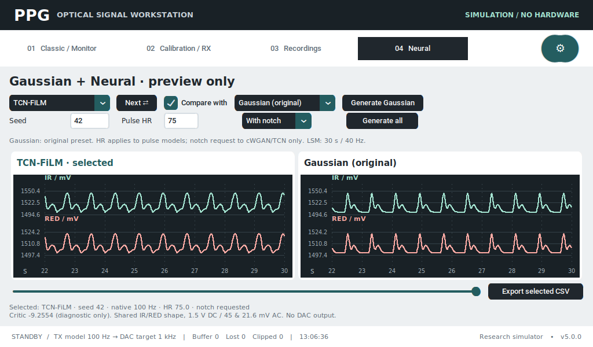
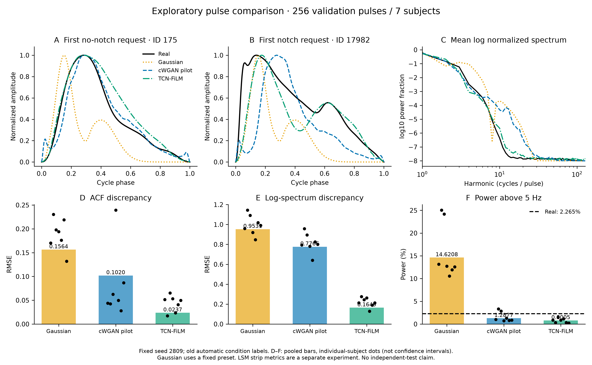

# Vòng 2: giữ Gaussian, tích hợp TCN và chuẩn bị fine-tune có kiểm soát

> Bản ghi lịch sử vòng 2. Menu nhiều mô hình mô tả bên dưới đã được thay bằng
> Gaussian fitted cạnh mẫu real. Xem [audit 5.113 nhịp và giao diện hiện tại](ppg_morphology_selection_2026-09-28.md).
> Các giới hạn về nhãn người duyệt, cohort độc lập và phần cứng vẫn còn áp dụng.

Ngày kiểm tra: 28/09/2026. Đã hoàn thiện phần mềm và đo lại trên dữ liệu thật
có sẵn. **Chưa hoàn thành fine-tune trên nhãn người duyệt hoặc xác nhận trên
cohort độc lập/Pi thật.** Không tạo nhãn giả để gọi các bước đó là đã hoàn thành.

## Kiểm kê công việc

| Hạng mục | Trạng thái và bằng chứng |
|---|---|
| Kaggle LSM v2, log/checkpoint/artifact | COMPLETE; 26 file tải lại khớp. [Audit v2](ppg_neural_preview_report_2026-09-28.md) |
| G/D, train/eval BatchNorm, IR/RED v2 | Đã kiểm tra checkpoint/export, BN và CSV. cWGAN pilot không lưu critic; không thể khôi phục từ G |
| Giữ bộ sinh 3-Gaussian | Đã giữ; hash `models/waveform.py`, `models/ppg_model.py`, `core/signal_engine.py` không đổi so với đầu vòng 2 |
| App bốn chế độ | Gaussian, cWGAN-GP, LSM-GAN, TCN-FiLM; chọn bất kỳ hai chế độ để xem cạnh nhau |
| TCN đã huấn luyện | Dùng seed 42, step 2800 của sweep đã có; chưa thay bằng model smoke |
| Evaluator và hình/bảng | Đã chạy trên 256 xung validation của 7 bệnh nhân; kết quả bên dưới |
| Bộ duyệt nhãn | Đã tạo 240 xung: 160 train, 80 validation, không có test; **0 nhãn đã được người duyệt** |
| Augmentation và fine-tune | Ba nhánh đã chạy thử hai bước, G/D thật có cập nhật, checkpoint/export đạt. Chưa chạy thí nghiệm nhãn đã duyệt |
| Test ngoài, chạy Pi/đo quang học | Chưa có cohort mới hoặc phiên đo phần cứng; không xác nhận chất lượng thực địa |

Mã nguồn, model sweep và kết quả cũ được giữ lại; không commit, không phát neural
ra DAC/LED và không chạy job Kaggle fine-tune mới trong vòng này.

## Dùng app hiện tại

Trang **01 Classic / Monitor** có nút **3-Gaussian** để chọn lại waveform PPG
nguyên bản. Nút chọn waveform không tự Start. Các điều khiển hình thái và
đầu ra truyền thống vẫn dùng engine cũ.

Trang **04 Neural**:

1. Chọn Gaussian/cWGAN-GP/LSM-GAN/TCN-FiLM trong menu, hoặc dùng **Next ⇄**.
2. Bật **Compare with**, chọn mô hình thứ hai để xem hai biểu đồ song song.
3. **Generate Gaussian** dùng bộ Gaussian gốc mà không cần torch/model neural.
   Đây là preset gốc để so sánh, không phải bản sao các thông số đang chỉnh trên Classic.
4. **Generate all** nạp năm file TorchScript trên CPU trong worker rồi tạo cả
   bốn preview. HR 40–180 áp dụng Gaussian/cWGAN/TCN; `With notch / No notch`
   chỉ là yêu cầu điều kiện cho cWGAN/TCN. Nhấn Generate để áp dụng thay đổi.
   Status ghi điều kiện của mẫu đã sinh, không lấy từ menu chưa áp dụng.
5. LSM giữ nguyên 30 giây ở 40 Hz, không điều khiển HR/notch. Các mô hình một
   nhịp được lặp ở HR yêu cầu và nội suy lên 100 Hz. Lưới pha 256 điểm không phải Fs.
6. **Export selected CSV** xuất 30 giây: Gaussian/cWGAN/TCN 3.000 dòng,
   LSM 1.200 dòng, kèm JSON (hash model, seed, điều kiện, Fs, hiệu chuẩn).



G/D đều `eval()` khi suy luận. TCN critic cho điểm thực không bị chặn trong
0–1; đó không phải xác suất hoặc phần trăm đúng. D của LSM cũng chỉ dùng
chẩn đoán. Neural không sửa engine hoặc tham số đầu ra đang chạy.

IR/RED dùng chung hình dạng: `IR = 1.5 + 0.045*x`, `RED = 1.5 + 0.0216*x`.
Đó là chuyển đổi điện áp danh định; không phải hai kênh được học độc lập hoặc
SpO₂ đo thực. Preview không có bộ lọc adapter của benchmark LSM cũ.

Bundle mới: [neural-models.tar.gz](../ml/runs/round2-preview/neural-models.tar.gz).
Giải nén tại gốc repo sau khi mang mã nguồn sang Pi; không chép `.venv` x86.

```bash
.venv/bin/python -m pip install -r requirements/neural.txt
tar -xzf /path/to/round2-preview/neural-models.tar.gz
.venv/bin/python main.py
```

Các lệnh cần môi trường Python/PyTorch phù hợp kiến trúc Pi. Đã xác minh trên
Linux x86_64 Python 3.12.3 / torch 2.10.0 CPU, chưa xác minh wheel/inference
trên Pi. App Classic và preview Gaussian không cần dependency neural.
Nếu có đầy đủ các run tải xuống, tạo lại model bundle bằng
`scripts/prepare_neural_preview.py`.

## Kết quả đo độc lập với detector huấn luyện

Dùng cùng 256 điều kiện validation (128 có notch, 128 không notch theo nhãn
tự động cũ), noise seed 2809 cho cWGAN và TCN. Gaussian dùng một preset cố
định nên không phải baseline đã fit tối ưu từng mẫu. SP/DN/DP được phát hiện
bằng Savitzky–Golay và đổi dấu đạo hàm, tách khỏi detector huấn luyện.
**Độc lập về thuật toán không có nghĩa là ground truth độc lập.**

| Mô hình | ACF RMSE ↓ | log-PSD RMSE ↓ | Năng lượng >5 Hz (%) | Độ gợn / real |
|---|---:|---:|---:|---:|
| Gaussian preset gốc | 0,15643 | 0,95309 | 14,62078 | 1,7542 |
| cWGAN pilot v1 | 0,10199 | 0,77659 | 1,28775 | 2,9476 |
| TCN-FiLM seed 42, step 2800 | 0,02370 | 0,16485 | 0,80051 | 1,5784 |
| Real validation tham chiếu | 0 | 0 | **2,26482** | 1 |

ACF RMSE so hai đường ACF trung bình trên 128 lag pha. PSD dùng cửa sổ Hann,
chuẩn hóa tổng công suất mỗi xung, log10 với epsilon 1e-8 rồi so phổ log trung
bình. Tần số vật lý cho ngưỡng 5 Hz suy từ harmonic × HR/60; không gán 256 Hz
cho lưới pha. Độ gợn là trung bình trị tuyệt đối sai phân bậc hai.

TCN khớp ACF/phổ tốt hơn pilot ở phép đo này, nhưng công suất >5 Hz chỉ khoảng
35,3% real, và độ gợn vẫn cao hơn real khoảng 1,58 lần. cWGAN gần tỷ lệ công
suất >5 Hz của real hơn TCN. **Không có mô hình thắng đồng thời cả ba tiêu chí.**
Không chọn chỉ từ loss hoặc điểm D; cũng không tự coi sóng mượt hơn là thật hơn.

Notch recall theo yêu cầu TCN là 127/128 (99,22%), specificity 128/128; cWGAN
là 1/128 và 125/128. Đây là khả năng tuân theo nhãn tự động cũ dưới detector
mới, chưa phải độ chính xác giải phẫu trên nhãn người duyệt. Mẫu thiếu mốc
bị phạt lỗi pha 1, không bị loại khỏi mẫu số. Gaussian cố định luôn có notch
nên không đáp ứng yêu cầu nhóm không notch.



[Bảng CSV](round2/comparison.csv) · [Hình PDF](round2/comparison.pdf) ·
[Metric đầy đủ theo bệnh nhân](round2/metrics.json) ·
[Mẫu và index gốc](../ml/runs/round2-independent-validation-final/samples.npz).
Hai xung minh họa là mẫu đầu tiên của mỗi lớp trong danh sách cố định, không
tìm mẫu đẹp nhất. Chấm đen ở biểu đồ là metric từng bệnh nhân, không phải CI.

Đây là **so sánh thăm dò** vì test đã được xem trong các vòng trước. Vòng 2
chỉ đọc train/validation, nhưng không làm test cũ trở thành chưa từng xem.
**cWGAN/TCN sinh một nhịp, LSM sinh đoạn dài nên không hoàn toàn ngang bằng.**
Không ghép số liệu pha ở bảng này với MMD²/PSD của đoạn 30 giây trong
[bảng LSM v2](ppg_neural_preview_report_2026-09-28.md).

## Kiểm duyệt và giao thức fine-tune

Mở [review.html](../ml/runs/round2-review/review.html) trực tiếp trong trình
duyệt hoặc dùng server local:

```bash
.venv/bin/python -m http.server 8779 --bind 127.0.0.1 --directory ml/runs/round2-review
```

Trang `http://127.0.0.1:8779/review.html` chứa waveform chuẩn hóa theo pha,
ẩn nhãn detector cũ. Người duyệt đánh dấu SP; nếu có notch cần SP < DN < DP,
chọn chấp nhận/không chắc/loại, nhập tên và xuất JSON để lưu tiến độ.
Không chắc thì không ép nhãn. Dữ liệu không tự lưu khi đóng trang; có nút
nạp lại JSON. Việc ghi tên reviewer là provenance, không xác thực chuyên môn.

Importer đối chiếu SHA-256 dataset, index duy nhất, bệnh nhân, split và thứ tự
mốc; không nhận test, NaN hoặc nhãn chưa quyết định làm dữ liệu train. Tối
thiểu 32 train (8 mỗi lớp), 16 validation (4 mỗi lớp) chỉ là ngưỡng chạy kỹ
thuật, chưa phải cỡ mẫu đủ cho kết luận nghiên cứu. Nên duyệt đủ gói 240 xung.

```bash
.venv/bin/python -m ml.round2_review --annotations /path/to/reviewed.json
.venv/bin/python -m ml.round2_finetune --annotations /path/to/reviewed.json --output ml/runs/round2-reviewed-v1
```

Ba nhánh đều khởi tạo cùng checkpoint TCN đã chọn, các seed 41/42/43,
300 bước/seed, batch 32, 3 bước D/một bước G, Adam lr 1e-5; chỉ augment train:

| Nhánh | Thay đổi |
|---|---|
| control | Fine-tune loss gốc với nhãn đã duyệt |
| relative_derivative | Thêm 0,05 × bình phương sai lệch độ gợn tương đối với real |
| time_warp | Warp đơn điệu nhỏ `phase + a*sin(2π*phase)`, `abs(a) <= 0.01`; biến đổi lại pha SP/DN/DP và mức DN/DP tương ứng |

Parent không lưu optimizer nên đây là **warm start với optimizer mới**, không
phải resume chính xác run sweep. Parent step 0 luôn là ứng viên checkpoint;
không mặc định bước cuối là tốt nhất. G/D/optimizer và RNG của checkpoint tốt
được lưu, có `last.pt`, history và TorchScript G/D kiểm tra parity.

Điểm development hiện chốt **trước thí nghiệm nhãn đã duyệt**:
`SP_MAE + .25*(2-recall-specificity) + .25*(DN_MAE+DP_MAE)
 + .1*logPSD_RMSE + ACF_RMSE + abs(HF_generated-HF_real)`.
HF là phân số, không phải phần trăm. Đây là heuristic chưa được kiểm định;
các trọng số bổ sung được đặt sau khi đã xem baseline vòng 2, không được mô
tả là toàn bộ công thức đã preregister trước v2. Ba tiêu chí phổ/ACF/HF vốn
đã chốt trước v2 vẫn được báo riêng. Không dùng điểm này để tự động đưa
checkpoint mới vào app hoặc kết luận chất lượng ngoài phân phối.

Chạy thử thật `--smoke`: 2 bước cho mỗi nhánh, seed 42, batch 4, 16 train /
16 validation mang nhãn tự động cũ. Cả G và D thay đổi trọng số; ba export
G/D khớp checkpoint. Trạng thái rõ `PIPELINE_SMOKE_ONLY`; không đưa model
smoke vào app và không coi chênh lệch hai bước là kết quả augmentation.
[Cấu hình và source hash](../ml/runs/round2-smoke-final/configuration.json) ·
[Bằng chứng cập nhật/export/CSV](round2/verification.json).

Sau khi có nhãn cần chạy đủ thí nghiệm, báo các seed và từng tiêu chí, kiểm
tra độ đa dạng khi giữ nguyên điều kiện, gần mẫu train và lỗi biên. Cần thêm
cohort mới chưa được xem để đánh giá cuối; chưa có bằng chứng buộc phải đổi
sang kiến trúc mới phức tạp hơn TCN hiện tại.

## Kiểm thử và tái lập

- Full suite: **709 passed, 1 skipped, 288 subtests passed**; 5 cảnh báo
  TorchScript deprecated, không có test fail.
- Smoke app với model thật: 1280×800 và 1024×600; Gaussian không nạp torch,
  sinh nền, chọn bốn chế độ/hai biểu đồ, notch sau Generate, CSV, đổi trang và
  engine đang chạy được kiểm tra trong **dry-run**. Không coi dry-run là đo DAC.
- Hash ba file Gaussian/engine khớp bản sao đầu vòng 2; `git diff --check` sạch.
- Browser review hiển thị đúng 240 mẫu chưa duyệt; chuyển trước/sau hoạt động.
- Bốn CSV hữu hạn, bước thời gian đúng, 0–3,28 V, AC_RED/AC_IR = 0,48.
- UI và hình đã xem trực quan, có PNG/PDF riêng.

```bash
.venv/bin/python -m pytest -q
.venv/bin/python scripts/smoke_neural_ui.py
.venv/bin/python -m ml.independent_ppg_eval --output ml/runs/round2-validation-new
.venv-ml/bin/python -m ml.round2_figures --run ml/runs/round2-validation-new
.venv/bin/python -m ml.round2_finetune --smoke --output ml/runs/round2-smoke-new
```

Các thư mục run phải mới để tránh ghi đè thí nghiệm. Mẫu CSV/model lớn trong
`ml/runs` và `.ts` không được Git theo dõi; cần mang bundle/artifact khi chuyển máy.
